# Backend MongoDB Atlas

## Learning Objectives

- [ ] Knowing what MongoDB Atlas is
  - [ ] Creating an account for Mongodb Atlas
  - [ ] Creating a cluster and database
  - [ ] Setting up database user and security settings
  - [ ] Connecting with local app
- [ ] Setting up vercel with MongoDB Atlas

---

## MongoDB Atlas Introduction

For now, we have only worked with a local database hosted on our computer. However, when we host an application e.g. on Vercel, we cannot use our local database for such external projects.

In order to access our database, we need to make it accessible from the internet. This is why we depend on external providers to host our database. We will use MongoDB Atlas, a cloud provider for mongo databases.

---

## Setting up a MongoDB Atlas account and database

Follow this guide to set up your MongoDB Atlas account and your first database.

1. Go to [the MongoDB Atlas homepage](https://www.mongodb.com/atlas/database) and choose "Try Free" to start the process.
2. Create an account by providing your data or sign up using Google.
3. You might need to verify your MongoDB email adress.
4. You might be asked to tell MongoDB Atlas something about your future usecases:

5. To create a cluster, choose
   1. `M0 Free`,
   2. `aws`, and
   3. `Frankfurt` and click on "Create".

6. In the left-hand navigation, choose `Security > Quickstart` to generate a first user.
   1. Choose a username and a password.
   2. 🚨 Make sure to write down your password!
   3. Click on "Create User".

7. Scroll down to choose where you would like to connect from:
   1. Choose "My Local Environment".
   2. Click "Add My Current IP Adress".

8. In the left-hand navigation, choose `Security > Network Acess`.

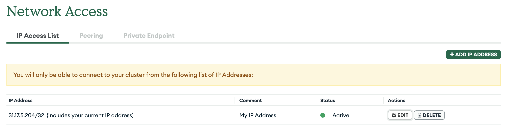

10. In the IP Access List, behind your IP Adress, click on "Edit".
11. In the pop-up window, click "Allow Access from Anywhere".

12. Your Network Access tab should now look like this:

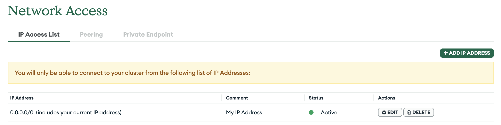

13. In the left-hand navigation, choose `Deployment > Database` which brings to this view:

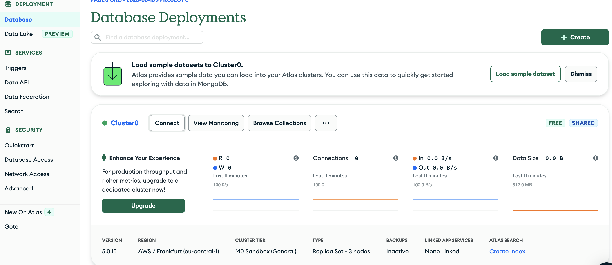

14. On the right side of your cluster's name (here "Cluster0"), click the "Connect" button.
15. In the pop-up window, click "Connect your application":

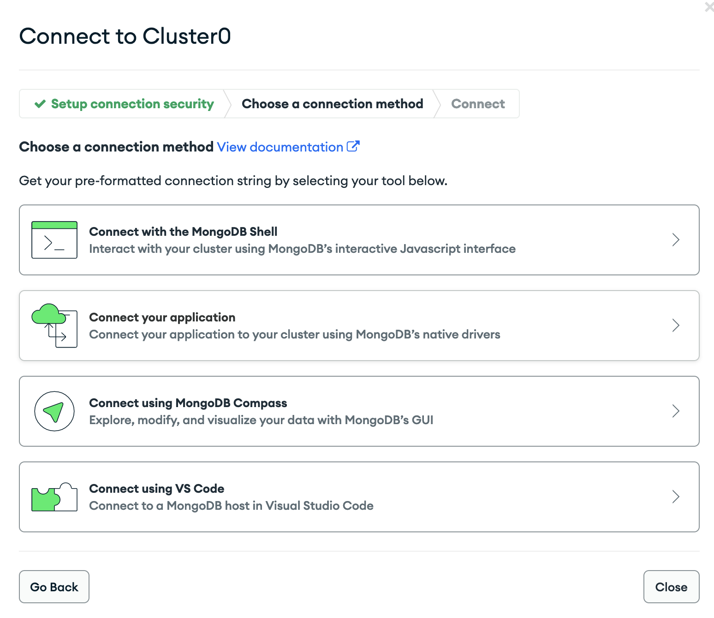

16. Create a database user with a username and a password:

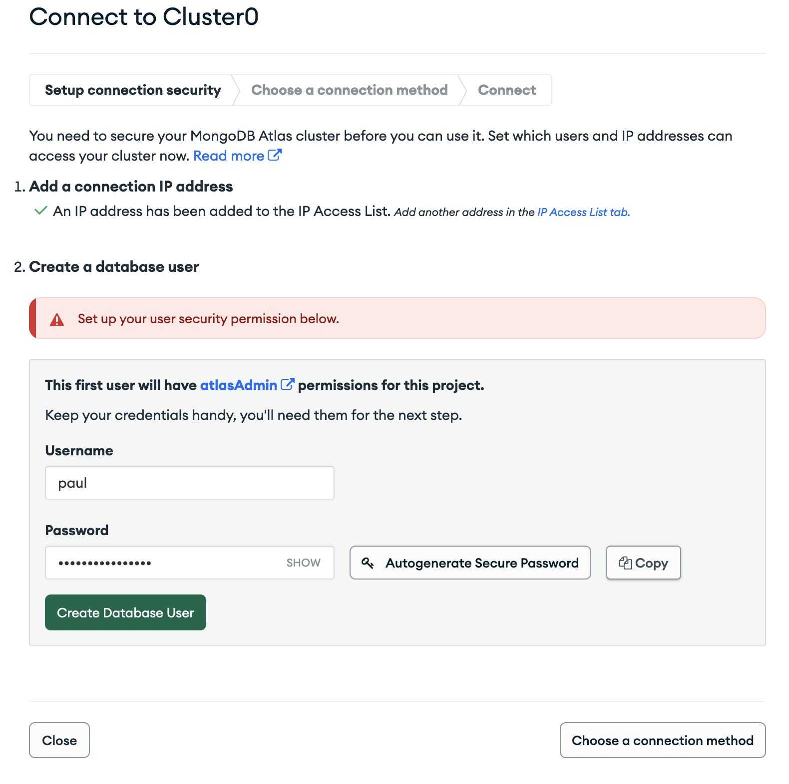

17. You should now see this screen:

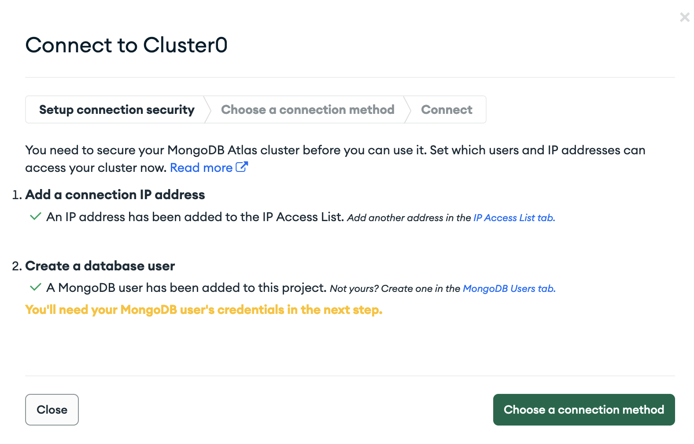

18. Click on "Choose a connection method". You will see a screen similar to the following:

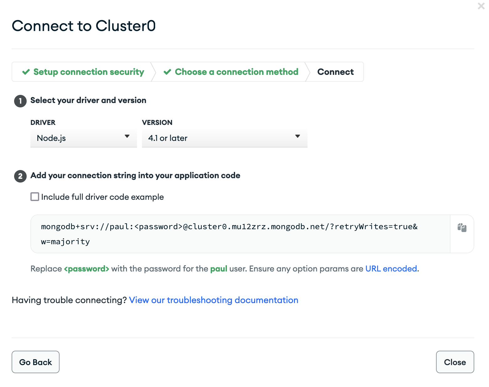

19. Copy the MongoDB URI (in this case, `mongodb+srv://paul:<password>@cluster0.mu12zrz.mongodb.net/?retryWrites=true&w=majority`). You will need it in your application.
20. Note the hint below: `Replace <password> with the password for the paul user.`
    1.  This is the user you have just created one step back (NOT the admin from the beginning).

## Connect your application with MongoDB Atlas

Creating a connection between your application and the cloud database in MongoDB Atlas is now very easy.

> 💡 We assume your app already has a local database connected.

1. In the root of your project, create a new file `.env`.
2. In the `.env` file, insert a variable called `MONGODB_URI` and declare it with the MongoDB Atlas URI you have created when setting up your connection above.
   1. The `.env` should look like this: `MONGODB_URI=mongodb+srv://paul:<password>@cluster0.mu12zrz.mongodb.net/<database-name>?retryWrites=true&w=majority`.
   2. Replace the `<password>` part with the password for your database user (in this case, the user is called "paul").
   3. Replace the `<database-name>` part with the name of your database (also remove the brackets `<>`). If the database is not existing in MongoDB Atlas, it will be created automatically.
   4. Note that you have to remove the brackets `<>` around the password as well.
3. Add `.env` to the `.gitignore` file if not already included. You can now delete your `.env.local` file.

4. Restart the development server and check your browser: you can now read, create, update and delete entries from your cloud database hosted by MongoDB Atlas! 🎉
5. You can check the collections and documents of your database via `Deployment > Database > Collections`:

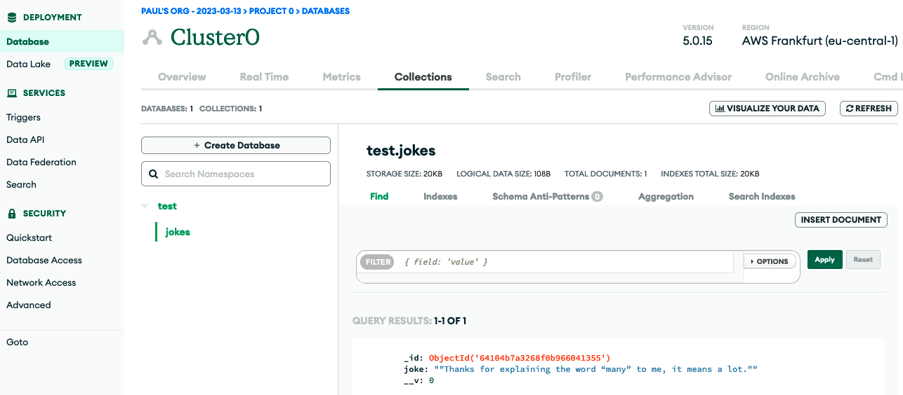

---

## Vercel and MongoDB Atlas (environment variables)

When deploying an application to Vercel, the app is not able to connect with your cloud database. This is because the authentication information (user and password) is stored in a `.env` file which is only available to your local development environment.

This is why we need to provide Vercel with the access details.

1. In the dashboard of your Vercel project, navigate to "Settings":

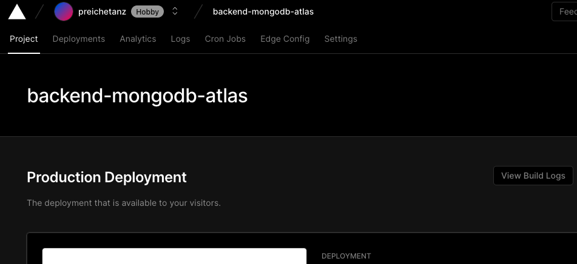

2. In the left-hand navigation, choose "Environment Variables".
   1. Add the key (`MONGODB_URI`) and the value (`mongodb+srv...`)
   2. Tick all environments (Production, Preview, and Development).
   3. Click "Save".

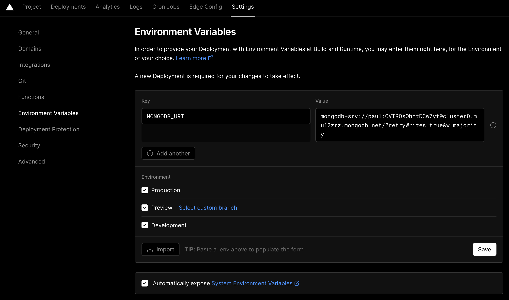

3. At the bottom of this page, you should now see a new environment variable:

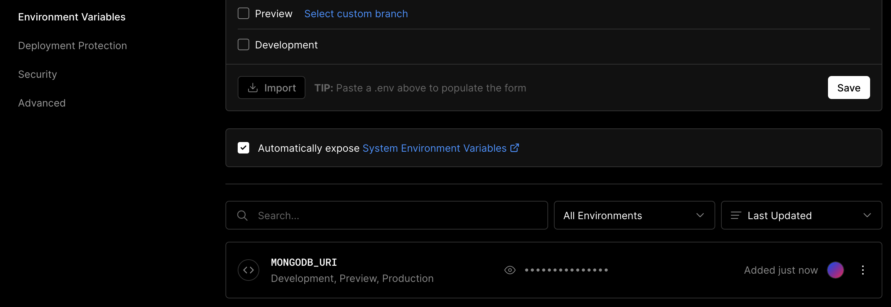

4. Redelpoy your application:
   1. In the main navigation, choose "Deployments".
   2. Open the three dots next to your last deployment and choose "Redeploy".

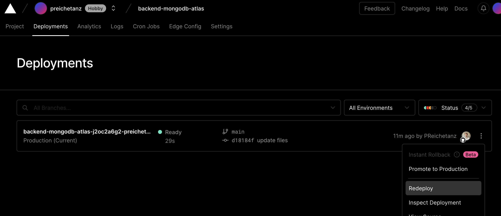

5. If there's a popup, hit the "Redeploy" button again.

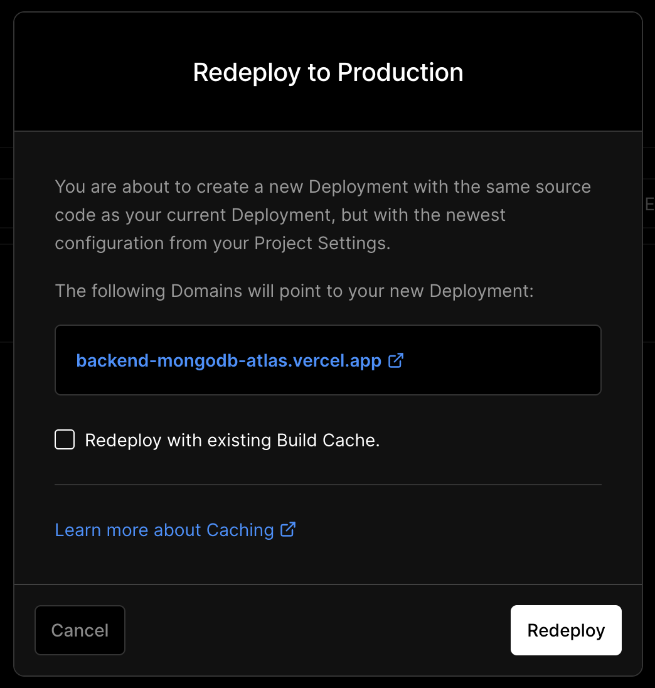

6. Congratulations, you are done! Open the Vercel URL of your project to see that your deployed application has now access to the cloud database.

> 📙 Read more about [how to set up environment variables in the Vercel docs](https://vercel.com/docs/concepts/projects/environment-variables).

## Resources

- [MongoDB Atlas Tutorial](https://www.mongodb.com/basics/mongodb-atlas-tutorial)
- [Environment Variables (Vercel Docs)](https://vercel.com/docs/concepts/projects/environment-variables)
