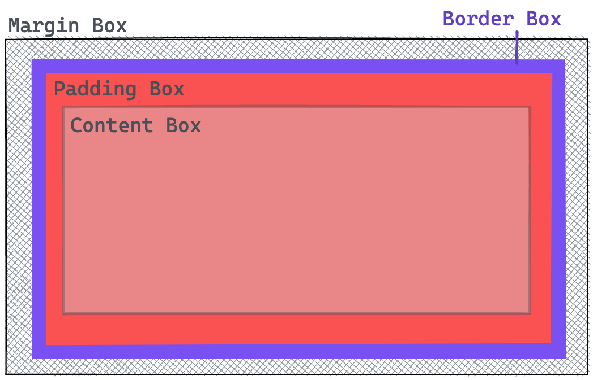

# CSS Basics

> 💡 feel free to create a personal branch of this guide to add your own notes

Recommended schedule for this session:

| duration | content         |
| -------- | --------------- |
| 1:00     | Session         |
| 1:30     | Active Learning |
| 0:15     | Recap           |

## Learning objectives

- [ ] What is CSS?
  - [ ] know difference between HTML/CSS
  - [ ] meaning behind the name CSS (`Cascading Style Sheets`)
- [ ] fundamentals of CSS:
  - [ ] `CSS syntax`: CSS ruleset (`selector`, `declaration`, `property`, `value`)
  - [ ] `selectors`: `universal` selector, `type` selectors, `class` selectors
  - [ ] `box model`: `border box` vs `content box` and the property `box-sizing`
  - [ ] `inline & block elements`
- [ ] how to link stylesheets

---

## Arrival: Motivate students and prepare them for today's topic(s)

> 💡 Breathe and relax :)

### Which important problem will we solve today?

How can we style our HTML elements as efficiently as possible.

### Why is the content of today's block that important for the students?

We often need to change the look of our HTML elements to make them fit to a design. And we want to
be able to apply these stylings to different elements to have a common look and to avoid repetitive
code.

### Pose a question to be answered by the end of the block!

How can I make it that the same stylings apply to multiple elements?

---

## Activate prior knowledge of students

We should not assume that students already have prior knowledge for CSS. But you can go into it
knowing that we've already learned how to structure our web page with HTML and will now understand
how to style those elements.

### Which previously learned concepts will be utilized in this session?

- HTML Basics

---

## Inform: Session Guide

**Notes:**

[One challenge](./challenges-css-basics.md#homework-personal-website-styling) is to apply stylings to the personal
website. Therefore, it should be considered that the students have already created a basic HTML
structure for their project.

Run this demo locally in your terminal:

```
npx ghcd@latest spicedacademy/fs-web-exercises/tree/main/sessions/css-basics/demo-start
```

You can check out the final version of this demo with:

```
npx ghcd@latest spicedacademy/fs-web-exercises/tree/main/sessions/css-basics/demo-end
```

### What is CSS?

Use the demo to explain what CSS is in general:

- [ ] **Definition**: CSS means Cascading Stylesheets. While HTML defines the structure and
      semantics of your content, we use CSS for design and layout.

- [ ] **Purpose**: CSS is a declarative language that controls how web pages look in the browser.
      The basic goal of CSS is to provide elements of the page with certain features like colors,
      positioning or decorations.

- [ ] **Meaning** of the **terms** `Cascading` and `Stylesheets`:
  - `Cascading`:
    - An algorithm that considers which style to apply when multiple styles are defined for an element.
    - Decides which style to apply based on:
      - Specificity: How specific the selector is in selecting the element.
      - Source Order: The last style defined in the stylesheet will override previous styles of the same specificity.
      - Inheritance: Styles can be passed down from parent elements to child elements.
    - Students will learn more about this in later sessions.
  - `Stylesheet`: A style sheet consists of several of stylings that we declare with CSS and that
    determine the layout of the web page.

### Syntax

Explain the syntax of a CSS rule/ruleset. You don't need to declare each part in deep, but you
should cover the following terms:

- [ ] **Selector**: A CSS selector is used to specify the elements to which CSS rules apply.
- [ ] **Property**: Name for a particular property to which a value is attributed.
- [ ] **Value**: The value we assign to a property.
- [ ] **Declaration**:Each pair of property and value is a declaration.

It may help to explain the syntax with a scribble in Excalidraw:


https://excalidraw.com/#json=6vTcgdviz8myOb-GrVCpe,zqt5qrO_mqG-hWCTMEwJRQ

### How to link stylesheets

- [ ] Explain what a stylesheet is:

  - [ ] a separate file where all the styles are written;
  - [ ] the file ending `.css` shows that it uses CSS syntax;
  - [ ] for now, we've agreed to name this file `styles.css` and place it in a separate `css` folder.

- [ ] Note that we need to link the `styles.css` file with the `index.html` so that the browser knows from where to load the styles.
- [ ] Link both files by adding `<link rel="stylesheet" href="./css/styles.css" />` to the `<head></head>` of the `index.html`.

### Basic selectors

- [ ] Explain the most basic selectors:

- [ ] `universal` selector (may be introduced later when explaining the `box model` and
      `box-sizing`):

  - Selects all elements.
  - Syntax: `*`

- [ ] `element` or `type` selector:

  - Selects all elements of a specific type.
  - Syntax: `elementName` like `article`, `section` or `body`

- [ ] `class` selector:

  - Selects all elements that have the given class attribute.
  - Syntax: `.classname` for example `.button`, `.highlighted` or `.list`

Show useful `CSS properties` that the students may need later for the challenges. Suitable examples
could be:

- `background-color`
- `color`
- `border`
- `border-radius`
- `text-decoration`
- `text-align`

- [ ] Show that, if you remove the `<link>` to the stylesheet in the `index.html` file, the styles are not loaded.
- [ ] Note that students will most likely run into this issue at least once.

### Box model & `box-sizing`

To make good layouts with CSS and to understand how the styling with CSS works, the students should
learn to understand the **box model** and why the `property` `box-sizing` is very helpful.

- [ ] **Box model**: Every element is a rectangular box. This means that everything has a box around
      it. Every box consists of four parts. Explain via a scribble in Excalidraw:



- [ ] Explain the following terms:

  - `Content`: The actual content of the element.
  - `Padding`: Space between the content and the border of the element.
  - `Border`: The border of the element.
  - `Margin`: The space around the border and other elements. An empty / outermost area around the
    border area, separates the element from its neighbors.

- [ ] Show the default value `box-sizing: content-box`:
  - [ ] if you set `width` (or `height`), they are only applied to the `content-box`;
  - [ ] if you add `padding` and `border`, these values are added as well;
  - [ ] this means that the actual width of the element is `width` + `padding` + `border`.
- [ ] Summarize that `box-sizing: content-box` makes life hard because you have to consider `padding` and `border` when creating responsive layouts.

- [ ] Show the alternative value `box-sizing: border-box`:
  - [ ] if you set `width` (or `height`), they are applied to the `border-box`;
  - [ ] values for `padding` and `border` adapt to this `width`/ `height` value;
  - [ ] the actual with of the element is always the value of `width` you've specified.
- [ ] Note the **benefit**: Calculating sizes of elements is easier and more intuitive with `border-box` because we determine how the total `width` and `height` of an element is calculated.

### Inline & block elements & `display`

- [ ] Note that every element on a web page is a rectangular box.
- [ ] Show that the space this rectangular box takes up depends on whether the element is an inline or block element.
  - [ ] **Block elements**:
    - [ ] The width of a block element depends on the available space within its parent element.
    - [ ] By default, the block element always takes the full width unless you have changed the value
          yourself with CSS.
    - [ ] Each new block element also creates another paragraph: subsequent elements slide under the block
          element. This is called 'normal flow'.
    - [ ] Common block elements: `<article></article>` `<section></section>`, `<p></p>` `<nav></nav>`, the
          headings from `h1` to `h6`
  - [ ] **Inline elements**:
    - [ ] Wrapping parts of a text in inline elements does not break the flow of the text.
    - [ ] An inline element will apply margin and padding, but break to the next line.
    - [ ] Margin and padding will push elements only horizontally and not vertically.
    - [ ] An inline element will NOT apply declarations with `width` and `height`.
    - [ ] Common inline elements: `<em></em>`, `<strong></strong>` and `<span></span>`.

### **Optional:** How to use [Google-Fonts](https://fonts.google.com/)

> 💡 If students are eager to use Google Fonts, note that there are legal issues with the ways Google provides for importing the fonts. [A work-around](css-basics.md#styling-fonts) and an [explanation of the problem](css-basics.md#legal-issues-using-google-fonts-with-import-and-link) can be found in the handout.

---

## Process: Challenges

- [ ] Provide the [handout](css-basics.md) and the [challenges](challenges-css-basics.md) to the students
- [ ] Open the handout and walk the students through the tasks
- [ ] Divide the students into groups
- [ ] Remind them of the ground rules:
  - meet again 30 min before lunch break in the class room
  - they can ask the coaches for help at any time
  - always try to help each other
  - take a break within the next 1.5 hrs
  - keep an eye on Slack

---

## Evaluate: Recap of the assignment / Discussion of the MVP / Solution

- Revisit the question that was posed in the beginning of the session and try to answer it with a
  few phrases.

---

## Checkout

> 💡 In case the students seem frustrated try to find some encouraging words (e.g. remind them of
> how far they have come already) :)

- [ ] Summarize the day by repeating all of the topics that were discussed
- [ ] Highlight the progress made that day
- [ ] Encourage the students to repeat what they learned with practical exercises
- [ ] Remind them to rest :)

## Keywords for Recap:

ruleset, type selector, class selector, box model, stylesheet

> These keywords are for the weekly summary on Fridays. We use the keywords to automatically
> generate excalidraw tags with the help of
> [this amazing tool](https://github.com/F-Kirchhoff/tag-cloud-generator). The students structure
> the cards in a pattern that makes sense for them. Each tag, that is added to the structure needs
> to be explained in a few words by one student. We go in rounds one by one until all tags are
> included in the structure.
