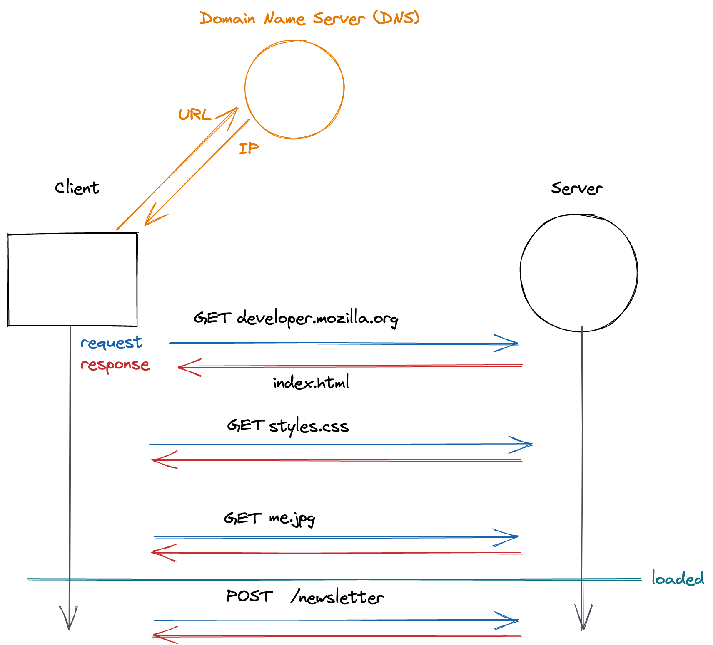
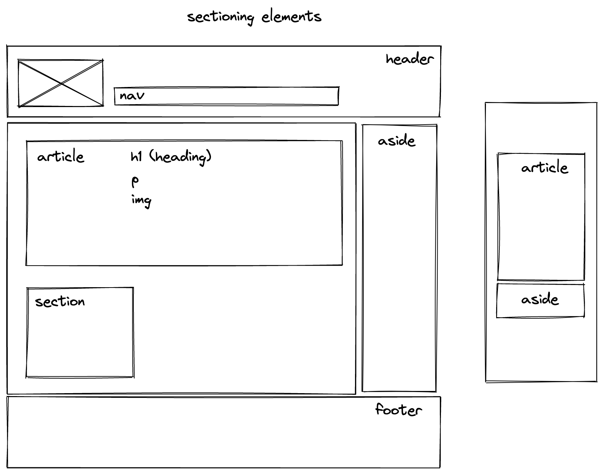

# HTML and the web

## Learning Objectives

- understanding client/server communication
- writing HTML code
- knowing about the importance of semantic HTML

---

## How the web works

The world wide web is a network of computers that can exchange information with each other. There
are many different protocols that define the rules on how machines communicate. Browsers use HTTP
(Hypertext Transfer Protocol) to communicate with web servers.

- The URL (Uniform Resource Locator) is the unique address of a resource on the web contains a human
  readable domain name, that needs to be resolved to the technical IP (Internet Protocol) address of
  the web server via a DNS (Domain Name Server)
- The browser sends a **GET** (that's an HTTP method) **request** to load a HTML (Hyper Text Markup
  Language) document from a web server
- The web server sends a **response** containing the document
- Often the HTML code contains references to additional resources (CSS (Cascading Style Sheet)
  files, images, etc.), which the browser then also requests from the server
- The browser **renders** the received content to the screen and makes it interactive
- Browsers might also request additional data from servers later via subsequent **GET** or **POST**
  requests



---

## HTML basics

HTML (Hyper Text Markup Language) is used to express text in a structured way. HTML tags indicate
what kind of element is displayed on the website. For example, a headline is written like this:

```html
<h1>I am a headline!</h1>
```

The content considered as headline is wrapped within an **opening tag** and a **closing tag**. The
whole thing is called an **element**.

Elements are nested into each other to create structure and hierarchy.

```html
<h1>I am a <em>headline!</em></h1>
```

Some elements can't contain any other elements and therefore don't have a closing tag. They are
self-closing and called
[_empty elements_](https://developer.mozilla.org/en-US/docs/Glossary/Empty_element).

```html
<hr />
or
<br />
```

### HTML tag attributes

Some elements require some more information in order to work properly. This information is
specified via attributes, for example:

- the source of an image
  ```html
  
  ```
- the destination of an anchor element
  ```html
  <a href="https://example.com"> click me </a>
  ```
- the type of an input element
  ```html
  <input type="date" />
  ```

> 💡 The [MDN web docs](https://developer.mozilla.org/en-US/docs/Web/HTML/Attributes) contain
> detailed information about elements and corresponding attributes.

### Layout of an HTML file

Every HTML document starts with a
[doctype](https://developer.mozilla.org/en-US/docs/Glossary/Doctype) followed by the `<html>`
element, which consists of two main parts:

- The `<head>` contains important meta information for the browser like
  - the charset (utf-8)
  - the favicon displayed in the tab
  - the title of the website
  - CSS and JavaScript files needed for the website
- The `<body>` contains the visible content of the website structured by html elements

```html
<!doctype html>
<html>
  <head>
    … meta information, additional links to CSS / JavaScript files …
  </head>
  <body>
    … elements displayed on the web page …
  </body>
</html>
```

### List of common HTML elements

| element             | meaning                                                      |
| ------------------- | ------------------------------------------------------------ |
| `<head></head>`     | only once per website, includes meta data and linked files   |
| `<body></body>`     | only once per website, includes the html website content     |
| `<h1></h1>`         | only once per website, a level one heading                   |
| `<h2></h2>`         | a level two heading                                          |
| `<p></p>`           | a paragraph                                                  |
| `<a></a>`           | an anchor (link)                                             |
| ``             | an image (self-closing / empty)                              |
| `<form></form>`     | a form element                                               |
| `<input>`           | an input field (self-closing / empty)                        |
| `<button></button>` | a clickable element equipped with some kind of functionality |

> 💡 A comprehensive [list of all html elements can be found at the MDN web docs](https://developer.mozilla.org/en-US/docs/Web/HTML/Element#inline_text_semantics).

---

## Structuring a Website

Developers have two main tools to express a meaningful structure in a website:

1.  Using semantic HTML elements
2.  Nesting / grouping of HTML elements

### Semantic HTML

Semantic HTML elements not only divide the content of the web page into distinct parts, but also
describe the function or purpose of the elements. This has two major benefits:

- The HTML becomes more understandable for other developers
- Accessibility tools and search engines can interpret the website

Therefore, one should use semantic HTML elements whenever possible.

### List of Semantic HTML elements

| element                 | meaning                                                                                                             |
| ----------------------- | ------------------------------------------------------------------------------------------------------------------- |
| `<main></main>`         | only once per website, includes the main content of the page                                                        |
| `<section></section>`   | a generic standalone section of a document                                                                          |
| `<ul></ul>`/`<ol></ol>` | a list of elements with the same structure, only has `<li>` elements as direct children                             |
| `<nav></nav>`           | a navigation bar                                                                                                    |
| `<aside></aside>`       | element representing a portion of a document whose content is only indirectly related to the main content           |
| `<article></article>`   | representing a self-containing part of the website, which is intended to be independently distributable or reusable |
| `<header></header>`     | representing introductory content, typically a group of introductory or navigational aids                           |
| `<footer></footer>`     | typically contains information about the author of the section, copyright data or links to related documents        |

> 💡 You can find a comprehensive [list of semantic html elements in the MDN web docs](https://developer.mozilla.org/en-US/docs/Glossary/Semantics).

### Nesting HTML elements

Nesting groups elements together in a meaningful way. The element containing the other elements is
called the **parent element**, which contains one or more **child elements**.

The following cases are typical examples of nested elements:

- ```html
  <ul>
    <li>first item</li>
    <li>second item</li>
    <li>third item</li>
  </ul>
  ```
- ```html
  <article>
    <h2>Some headline</h2>
    <p>I am a paragraph…</p>
    <a href="https://www.github.com">a link to another website</a>
  </article>
  ```
- ```html
  <button>
    
    <span> submit </span>
  </button>
  ```

Below is a sketch of how semantic elements can be nested in a web page.<br><br>


## Emmet

Visual Studio Code has a useful tool called Emmet which lets you autocomplete a lot of code by just
typing certain snippets and pressing the <kbd>Tab</kbd> key afterwards. Try these snippets inside an
HTML file and see what happens:

- `!`
- `.highlight`
- `button#red`
- `ul>li.card\*10`

> 💡 You can learn about more Emmet commands in
> [this cheat-sheet](https://docs.emmet.io/cheat-sheet/)

---

## Resources

- [MDN: Introduction to HTML](https://developer.mozilla.org/en-US/docs/Learn/HTML/Introduction_to_HTML)
- [MDN: Getting started with HTML](https://developer.mozilla.org/en-US/docs/Learn/HTML/Introduction_to_HTML/Getting_started)
- [MDN: HTML Elements](https://developer.mozilla.org/en-US/docs/Web/HTML/Element)
- [MDN: Semantic elements: Glossary](https://developer.mozilla.org/en-US/docs/Glossary/Semantics)
- [MDN: HTML attributes](https://developer.mozilla.org/en-US/docs/Web/HTML/Attributes)
