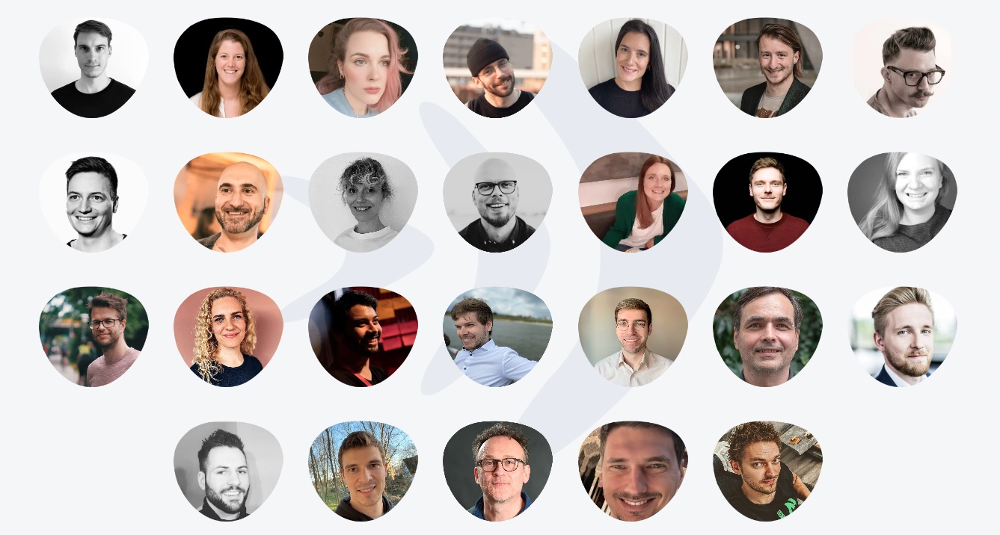
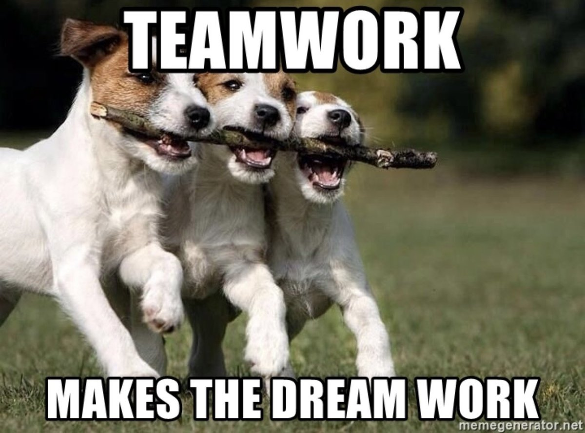
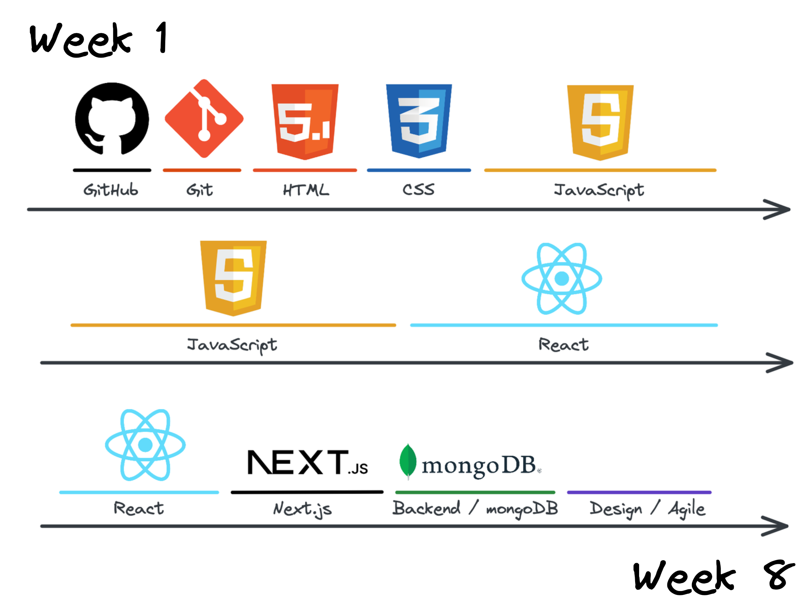

<!-- _class: intro-slide granite -->

# Welcome at _neue fische_

---

<!-- _class: big-headline granite -->

# Your _neue fische_ Team

---

<!-- class: image-profile -->

## Franz Wilhelmy

Student Service

---

<!-- class: image-profile -->

## Sina Stulpe

Candidate Success Management

---

## Oliver Fohrmann

Partner Management

---

## Peter Anderson

Coach

---

## Diego Caponera

Coach

---

## CJ Akkuec

Coach

---

<!-- _class: big-headline granite-->

# The Coach Team at _neue fische_

---

<!-- _class: image-center -->

---

<!-- _class: big-headline granite-->

# Get-to-know

---

<!-- _class: bullet-points -->

# Introductions 👋

- What's your name and location?
- What was your top favorite hobby as a teenager?

---

<!-- _class: bullet-points small-->

# _One truth_ One lie

- You've got **five minutes** to:
  1. think of a **lie**
  2. think of a **truth**
- Everyone presents both their lie and truth to the group
- The rest of the group has to guess what's the lie and what's the truth, for example:
  - Story Nr.1 is true ✅
  - Story Nr.2 is a lie ⛔️
- Afterwards, the "storyteller" will reveal what's the truth and what's the lie - there are no prizes, though 🙂

---

<!-- _class: big-headline granite-->

# How and what we'll learn as a team

---

## Teamwork

makes the dream work

---

<!-- _class: big-headline granite-->

# _Personal_ Progress

---

## Personal Progress

Moving from the Fear Zone to the Growth Zone

---

<!-- _class: big-headline granite-->

# _Bootcamp_ Weekly Overview

---

<!-- _class: image-center -->

---

<!-- _class: bullet-points small-->

# The First Eight Weeks

- **GitHub & Git**
- **HTML**
- **CSS**
- **JavaScript**
- **React** Basics, State, React Hooks
- **Next** Basics, Routing,
- **React** styled-components, Testing, Global State
- **Backend** MongoDB,
- **Agile & Design** UX/UI, User Stories, Product Thinking

---

<!-- _class: bullet-points small-->

# Capstone phase

**Week 9 - 12**

| Week   | Task                                |
| ------ | ----------------------------------- |
| **9**  | Capstone - Sprint 1                 |
| **10** | Capstone - Sprint 2 + Sprint Review |
| **11** | Capstone - Sprint 3 + Sprint Review |
| **12** | Capstone - Sprint 4 + Graduation 🎓 |

---

<!-- _class: big-headline granite-->

# _Bootcamp_ Schedule

---

<!-- _class: bullet-points small-->

# Morning

**9:00 - 13:00**

| Time      | Task                                  |
| --------- | ------------------------------------- |
| **09:00** | Open Questions, Attendance Screenshot |
| **09:30** | Check-in with Coaches                 |
|           | **Part I**                            |
|           | Session, Active Learning, Recap       |
| **12:15** | Research Time                         |
| **13:00** | Lunch break                           |

---

<!-- _class: bullet-points small-->

# Afternoon

**14:00 onwards**

| Time      | Task                            |
| --------- | ------------------------------- |
| **14:00** | Recap and Q&A                   |
| **14:30** | **Part II**                     |
|           | Session, Active Learning, Recap |
| **17:00** | Checkout                        |
|           | **Self-organized Learning**     |

---

<!-- _class: big-headline granite-->

# _Bootcamp_ Tips & Tricks

---

<!-- _class: bullet-points small-->

# Sustainable Learning 📖

- **Trust yourselves** — sometimes you can't immediately fully understand a new concept
- **Pose questions** — be brave!
- **Daily practice** — repetition is necessary
- More **programming** than reading
- **Support each other** as individuals and as a team
- Try to solve problems **on your own**

---

<!-- _class: bullet-points small-->

# Stay healthy! 🍀

- Drink enough **water**
- Try to go **outside** frequently
- **Keep to a schedule** — get up at the same time and take walks during the lunch break
- **Know when to take a break** — you shouldn't be looking at screens all day
- **Mind your energy levels** — try to stay productive and motivated

---

<!-- _class: big-headline granite-->

# _Bootcamp_ Remote Work

---

<!-- _class: bullet-points-->

# Working with Zoom 🎥

- Camera stays on / mic stays muted
- Try not to communicate via the Zoom chat
- Use **Zoom Reactions** ✋
- Try to give visual **feedback**
- **Okay**✅: Drinking (water), eating, standing
- **Not okay**❌: Smoking, Lying down (unless medically necessary)

---

<!-- _class: bullet-points-->

# Working with Slack ✍️

- **Course Channel**
- **Threads**
- **Complete your profile**

---

<!-- _class: bullet-points -->

# Absence ... 🤒

1. Notify your coaches (Slack)
   IMPORTANT: **Sick note!**
2. Leave a notification in the course channel (Slack)

---

<!-- _class: intro-slide granite -->

# Any further questions?
