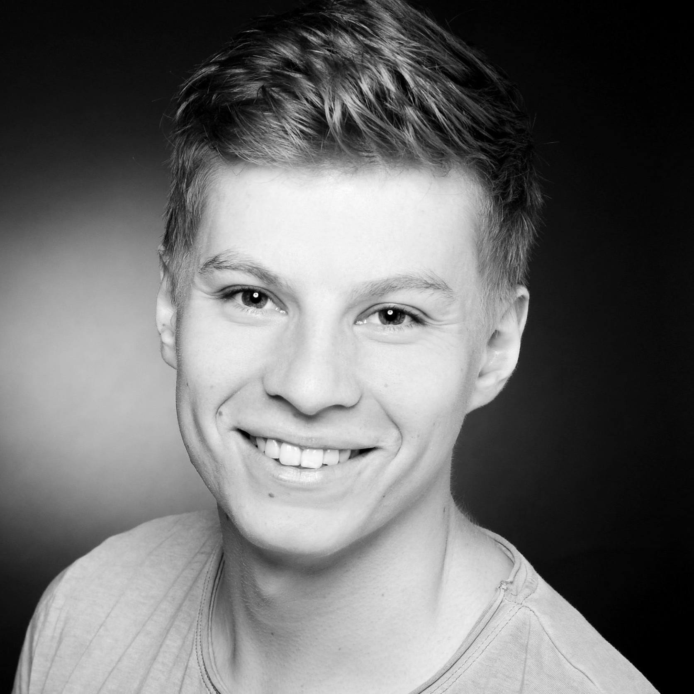
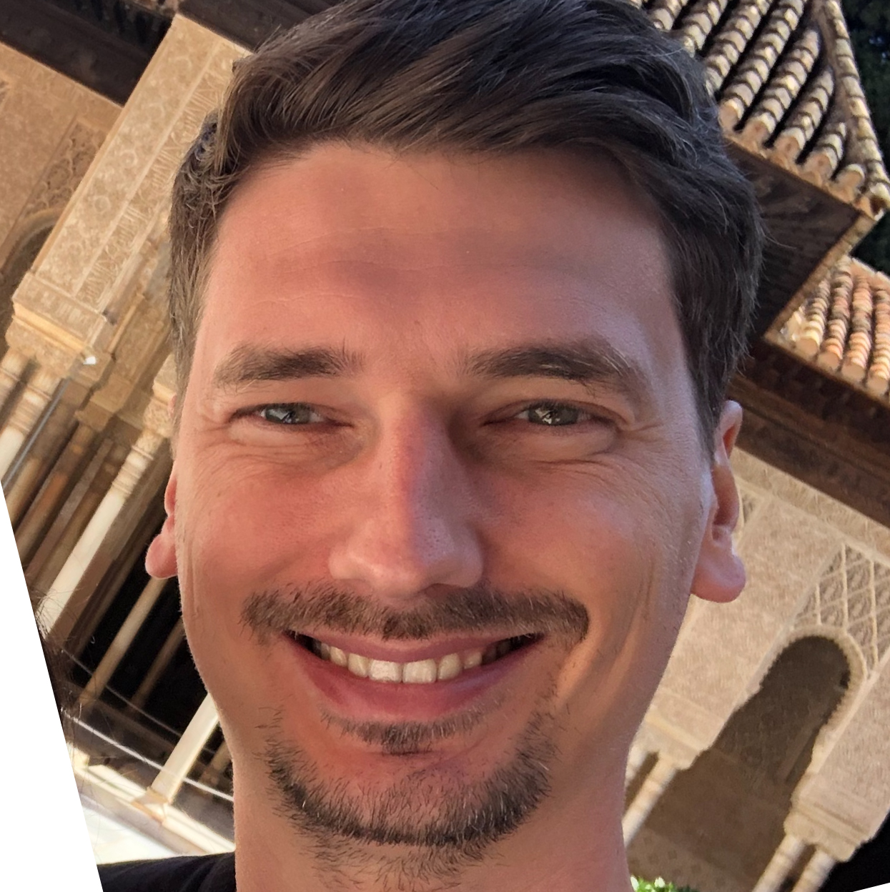
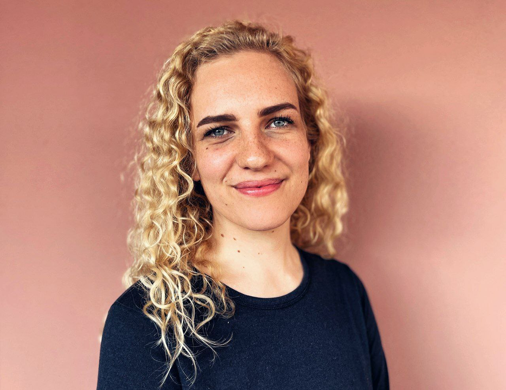

<!-- Jan  -->

<!-- _class: intro-slide granite -->

# Willkommen bei _neue fische_

---

<!-- _class: big-headline granite -->

# Euer _neue fische_ Team

---

<!-- class: image-profile -->

## Franz Wilhelmy

Student Service

---

<!-- class: image-profile -->

## Robin Liedel

Candidate Success Manager

---

## Thomas Kirst

Coach

---

## Merle Makoben

Coach

---

## Niklas Röttger

Coach

---

<!-- _class: big-headline granite-->

# Das Coach-Team bei _neue fische_

---

<!-- _class: image-center -->

---

<!-- _class: big-headline granite-->

# Kennenlernen

---

<!-- _class: bullet-points -->

# Vorstellungsrunde 👋

- Wie heißt du und wo lebst du?
- Was war dein Hobby als du 15 Jahre alt warst?

---

<!-- _class: bullet-points small-->

# _One truth_ One lie

- Nehmt euch **5 Minuten** Zeit, um über euch:
  1. eine **Lüge** auszudenken
  2. eine **Wahrheit** auszusuchen
- Jede/r erzählt die beiden Geschichten
- Der Rest von uns schätzt welche Geschichte wahr ist:
  - Geschichte 1 ist wahr ✅
  - Geschichte 2 ist wahr ⛔️
- Danach wird aufgelöst - Gewinne gibt es keine 🙂

---

<!-- Stefan  -->

<!-- _class: big-headline granite-->

# Wie und was _wir gemeinsam_ lernen

---

## Teamwork

makes the dream work

---

<!-- _class: big-headline granite-->

# _Individuelle_ Entwicklung

---

## Individuelle Entwicklung

Moving from the Fear Zone to the Growth Zone

---

<!-- _class: big-headline granite-->

# _Bootcamp_ Wochenübersicht

---

<!-- _class: image-center -->

---

<!-- _class: bullet-points small-->

# Die ersten 8 Wochen

- **GitHub & Git**
- **HTML**
- **CSS**
- **JavaScript**
- **React** Basics, State, React Hooks
- **Next.js** Basics, Routing
- **React** styled-components, Testing, Global State
- **Backend** Next.js, API Design, MongoDB
- **Agile & Design** UX/UI, User Stories, Product Thinking

---

<!-- _class: bullet-points small-->

# Capstonephase

**Woche 9 bis 12**

| Woche  | Aktivität                            |
| ------ | ------------------------------------ |
| **9**  | Capstone - Sprint 1                  |
| **10** | Capstone - Sprint 2 + Sprint Review  |
| **11** | Capstone - Sprint 3 + Sprint Review  |
| **12** | Capstone - Sprint 4 + Abschlussevent |

---

<!-- _class: big-headline granite-->

# _Bootcamp_ Tagesablauf

---

<!-- _class: bullet-points small-->

# Vormittag

**9:00 Uhr bis 13:00Uhr**

| Zeit      | Aktivität                       |
| --------- | ------------------------------- |
| **09:00** | Offene Fragen, Anwesenheitsbild |
| **09:30** | Checkin mit Coaches             |
|           | **Teil I**                      |
|           | Session, Active Learning, Recap |
| **12:15** | Research Time                   |
| **13:00** | Mittagspause                    |

---

<!-- _class: bullet-points small-->

# Nachmittag

**ab 14:00 Uhr**

| Zeit      | Aktivität                        |
| --------- | -------------------------------- |
| **14:00** | Recap und Q&A                    |
| **14:30** | **Teil II**                      |
|           | Session, Active Learning, Recap  |
| **17:00** | Checkout                         |
|           | **Selbstorganisierte Lernphase** |

---

<!-- Jessica  -->

<!-- _class: big-headline granite-->

# _Bootcamp_ Tipps

---

<!-- _class: bullet-points small-->

# Nachhaltiges Lernen 📖

- **Habt Vertrauen in euch** - manchmal kann man nicht
  alles auf Anhieb verstehen
- **Stellt Fragen** - traut euch
- **Täglich üben** - Wiederholungen helfen
- Mehr **programmieren** als lesen
- Versucht Probleme **selbstständig** zu lösen
- Findet euch in Gruppen zusammen und **unterstützt euch**

---

<!-- _class: bullet-points small-->

# Bleibt gesund! 🍀

- Trinkt viel **Wasser**
- Regelmäßig an die **frische Luft** gehen
- Regelmäßig aufstehen – sich **bewegen in Pausen**
- **Abends ein "Ende finden"** – Computer aus, Smartphone aus
- **Energielevel managen** – bleibt motiviert und leistungsfähig

---

<!-- _class: big-headline granite-->

# _Bootcamp_ Remote Work

---

<!-- _class: bullet-points-->

# Arbeiten in Zoom 🎥

- Kamera an / Mikrofon stumm,
- Nicht im Zoom Chat schreiben
- Melden über **Zoom Reactions**
- Visuelles **Feedback** geben
- **okay** Trinken, Essen, Stehen
- **nicht okay** Rauchen, Liegen

---

<!-- _class: bullet-points-->

# Arbeiten mit Slack ✍️

- **Course Channel**
- **Threads**
- **Profil vervollständigen**

---

<!-- _class: bullet-points -->

# Abwesenheit 🤒

1. Benachrichtung an Coaches (Slack)
   wichtig: **Krankmeldung!**
2. Benachrichtung in Kurs Channel (Slack)

---

<!-- _class: intro-slide granite -->

# Fragen?!
