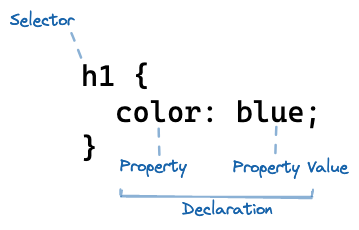
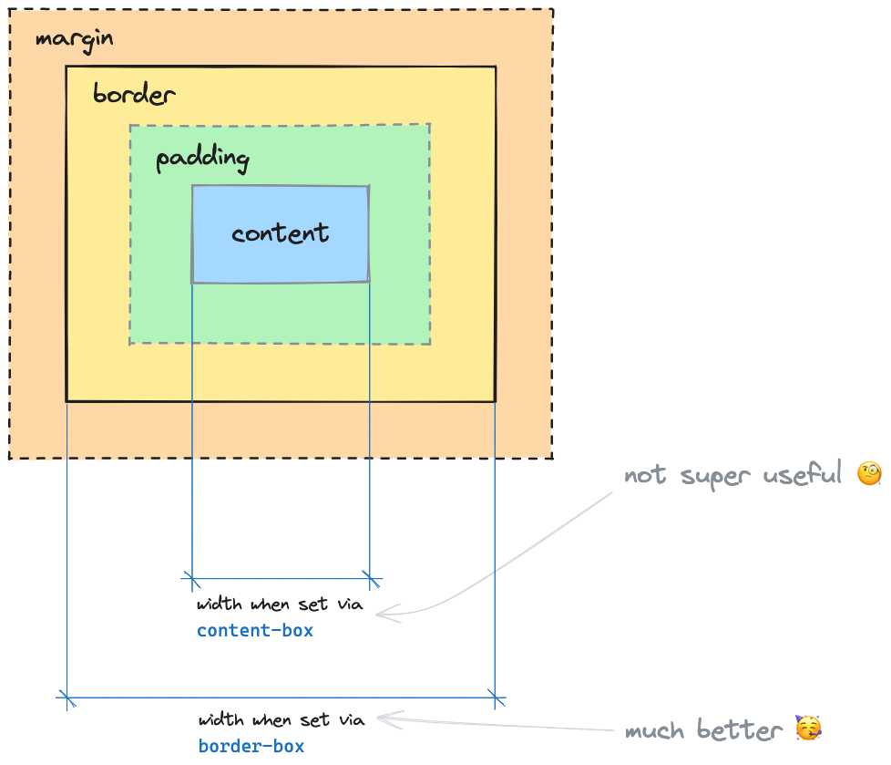
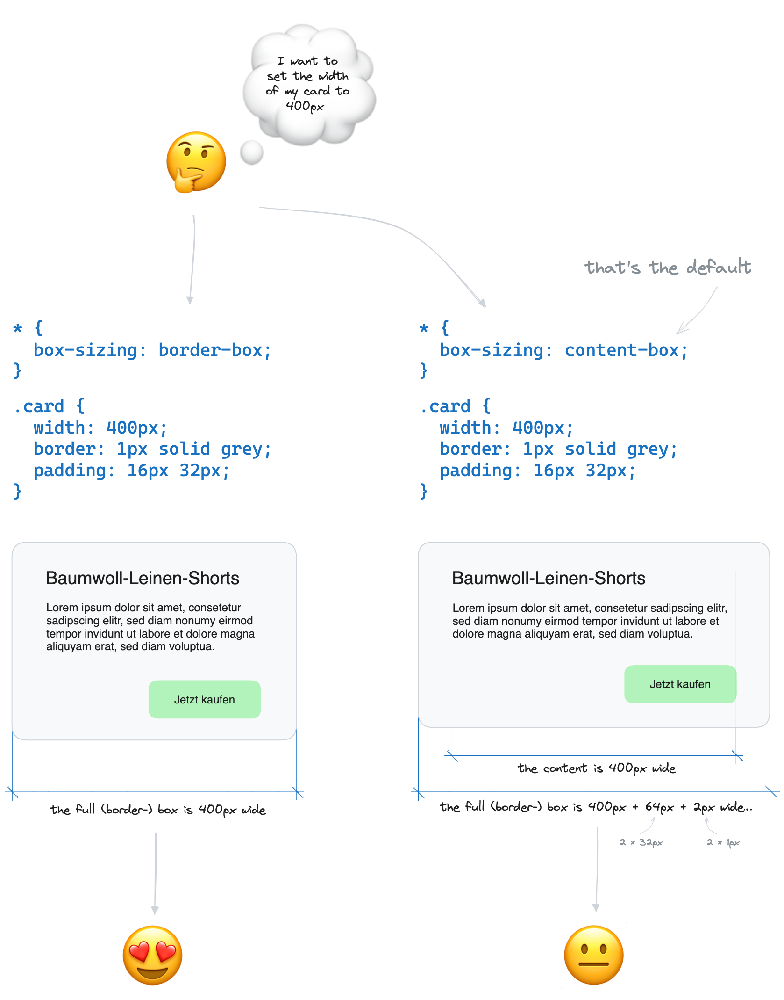

# CSS Basics

## Learning Objectives

- [ ] having a general understanding of the purpose of CSS
- [ ] knowing what Cascading Style Sheets means
- [ ] understanding the fundamentals of CSS: CSS syntax, selectors, box model,
      inline & block elements
- [ ] linking stylesheets to the HTML document

## What is CSS?

With CSS (_Cascading Stylesheets_) you can add styling to your HTML elements.


The term _cascading_ in CSS refers to an algorithm that resolves conflicts when multiple styles are defined for a particular element. When deciding which style to apply, CSS takes into account three key factors: specificity, source order, and inheritance.

- Specificity refers to how precisely a selector targets an element. Styles with higher specificity take precedence over those with lower specificity.

- The source order of styles also plays a role in determining which style should be applied. When multiple styles with the same specificity are defined, the style that appears last in the stylesheet will override any previous styles for that element.

- Additionally, CSS allows styles to be inherited from parent elements to their child elements. This means that certain styles can be passed down through the document tree, affecting multiple elements simultaneously.

The term _stylesheet_ refers to a collection of rulesets declared using CSS, usally within a `.css` file.

## Linking Stylesheets

To separate your HTML and CSS code, you can create a new file, like `css/styles.css` and link it to
your HTML file by placing a `<link>` tag in the `<head>` of your HTML document.

```html
<head>
  …
  <link rel="stylesheet" href="css/styles.css" />
</head>
```

## CSS syntax

Any stylesheet consists of a collection of **ruleset**s. A ruleset consists of four parts:



|                | Description                                                                                                              |
| -------------- | ------------------------------------------------------------------------------------------------------------------------ |
| Selector       | Selects to which elements the style declarations are applied, followed by curly braces (`{}`) enclosing the declarations |
| Declaration    | A combination of a property and a property value, separated by a colon (`:`) and ending with a semicolon (`;`)           |
| Property       | The property you want to style, e.g. `color`, `font-size`, `text-align`                                                  |
| Property Value | The value assigned to the property, e.g `blue` for the `color` property, `3rem` for the `font-size` property             |

A ruleset can have multiple declarations:

```css
h1 {
  color: blue;
  font-size: 3rem;
  text-align: center;
}
```

## Selectors

There are different CSS selectors you can use to select elements to which you want to apply styles.

### Type selector

The type selector selects all elements of a specific element type.

**Syntax**: `article`, `h1`, `p`, `div`, `a`, `input`, `button`, …

**Example**:

Select all `article` elements.

```css
article {
  color: red;
}
```

```html
<article>…</article>
```

### Class selector

The class selector selects all elements that have the specified class.

**Syntax**: `.superpink` (the user defined class name from the HTML but starting with a dot `.`)

**Example**:

Select all elements with the class `superpink`.

```css
.superpink {
  color: hotpink;
}
```

```html
<aside class="superpink">…</aside>
```

HTML elements can have multiple classes separated by a space. The selector `.superpink` would
also select the following element:

```html
<aside class="broccoli superpink some-other-class">…</aside>
```

The order of the classes in the HTML attribute doesn't matter.

### Pseudo-classes

The pseudo-class selector selects all elements that are in a specific state. It is used in combination with other selectors.

**Syntax**: `:hover`, `:focus`, … (the pseudo-class name starting with a colon `:`)

#### `:hover`

Selects an element when you hover over it with the mouse.

**Example**:

Select all hovered links.

```css
a:hover {
  color: hotpink;
}
```

```html
<a href="https://www.neuefische.de">neuefische</a>
```

#### `:focus`

Selects an element when it is focused. This is usually the case when you click into an input field or select an element with the tab key.

**Example**:

Select all focused input fields.

```css
input:focus {
  border: 1px solid hotpink;
}
```

```html
<input type="text" />
```

#### Other pseudo-classes

There are many more pseudo-classes like `:active`, `:first-child`, `:last-child`, `:first-of-type`, `:last-of-type`, `:nth-child()`, `:nth-of-type()`, `:not()`, …

> 📙 You can find a list of all [**Pseudo-classes** on mdn](https://developer.mozilla.org/en-US/docs/Web/CSS/Pseudo-classes).

### Attribute selectors

The attribute selector selects all elements based on the presence or value of a given attribute.

#### Basic attribute selector

Selects all elements with the specified attribute.

**Syntax**: `[attribute]` (attribute name in square brakets `[]`)

**Example**:

Select all elements that have a `type` attribute.

```css
[type] {
  border: 1px solid hotpink;
}
```

```html
<input type="text" />
```

#### Attribute value selector

Selects all elements with the specified attribute and value.

**Syntax**: `[attribute="value"]` (attribute name followed by `=` and the attribute value in quotation marks `""` — all in square brakets `[]`)

**Example**:

Select all elements that have a `type` attribute with the value `text`.

```css
[type="text"] {
  border: 1px solid hotpink;
}
```

```html
<input type="text" />
```

#### Advanced attribute selectors

With advanced attribute selectors you can also select elements that have an attribute with a
specific value at the beginning, end or in the middle of the value.

> 📙 You can find more information about [**Attribute selectors** on the mdn](https://developer.mozilla.org/en-US/docs/Web/CSS/Attribute_selectors).

### Universal selector

The universal selector `*` selects all elements in the document.

**Syntax**: `*`

**Example**:

Select all elements.

```css
* {
  border: 1px solid hotpink;
}
```

> ❗️ The universal selector is rarely used for anything but resets. Do not use it unless you know what you are doing.

## Combining Selectors

Combinators are used to combine multiple selectors to create a new selector.

### Combine multiple selectors with a comma

You can combine multiple selectors with a comma to create a new selector that selects all elements that are selected by **any one** of the selectors.

**Syntax**: `selector1, selector2, …`

**Example**:

Select all `h1`, `h2` and `h3` elements.

```css
h1,
h2,
h3 {
  color: hotpink;
}
```

### Descendant combinator

The descendant combinator ` ` (space) selects all elements that are descendants (children) of another selector.

**Syntax**: `selector1 selector2 …`

**Example**:

Select all `.superpink` elements that are descendants of an `article` element.

```css
article .superpink {
  color: hotpink;
}
```

```html
<article>
  <p class="superpink">I am pink</p>
  <p>I am not pink</p>
  <footer>
    <p class="superpink">
      I am pink, even though I am not a direct descendant of the article
    </p>
  </footer>
</article>
<p class="superpink">
  I am not pink because I am not a descendant of an article
</p>
```

### Other combinators

There are many more combinators like the direct descendant combinator `>`, the adjacent sibling combinator `+` and the general sibling combinator `~`. A good general rule is to use combinators (except the comma to combine selectors) very sparingly and only when necessary.

> 📙 You can find more information about [**Combinators** on the mdn](https://developer.mozilla.org/en-US/docs/Web/CSS/CSS_Selectors#combinators).

## CSS Properties

There are a lot of CSS properties and you will discover new ones every day. Therefore the following list shows only a few examples:

| Property           | Effect                                         |
| ------------------ | ---------------------------------------------- |
| `color`            | Color of an elements text                      |
| `font-size`        | Defines the size of a font                     |
| `text-align`       | Defines the alignment of text                  |
| `background-color` | Background color of an element                 |
| `border`           | Defines the border of an element.              |
| `padding`          | Defines the padding of an element.             |
| `margin`           | Defines the margin of an element.              |
| `width`            | This property defines the width of an element. |

> 📙 You can find more properties in the [alphabetic list of **Properties** on CSS-Tricks](https://css-tricks.com/almanac/properties/)
> or in the [**Index** of properties, pseudo-classes, pseudo-elements, data types, functional notations and at-rules on the mdn](https://developer.mozilla.org/en-US/docs/Web/CSS/Reference#index).

## Inheritance

Some CSS properties are inherited from the parent element to the child element. This means that the child element inherits the value of the property from the parent element if it is not set explicitly.

**Example**:

```css
body {
  color: hotpink;
}

p {
  /* The color of the paragraph is hotpink because it is inherited from the body */
}
```

```html
<body>
  <p>I am hotpink</p>
</body>
```

This is very useful for properties like `color` or `font-family` because you can set them on any element and all child elements will inherit the value.

> 📙 You can find more information about [**Inheritance** on the mdn](https://developer.mozilla.org/en-US/docs/Web/CSS/inheritance).

## Box Model

All elements of a website are rectangular boxes described by the **box model**. Each of those boxes has four areas: content, padding, border and margin.

| Box model part | Function                                                               |
| -------------- | ---------------------------------------------------------------------- |
| margin         | The outer space measured from the border to other elements on the page |
| border         | The border of the element                                              |
| padding        | The inner space between the content and the border of the element      |
| content        | The actual content box of the element                                  |



The browser knows two ways to calculate the size (`width` and `height`) of an element in this model: `content-box` (the default, old) and `border-box` (the modern variant).

In `content-box` mode, `width` and `height` only describe the size of the content box: The padding and border are added to the size of the element. This can be confusing and lead to unexpected results.

We can set the `box-sizing` property to `border-box` for all elements (using the universal selector) to make the `width` and `height` of an element include the padding and border box.

```css
* {
  box-sizing: border-box;
}
```

Now, the `width` property defines the size of the border box, padding and border width are
subtracted to calculate the available space for the content. This code will be in all used in all future projects to set a sensible default.



> 💡 The CSS Working Group (which produces the specification for CSS) keeps an [**Incomplete List of Mistakes in the Design of CSS**](https://wiki.csswg.org/ideas/mistakes), saying that `box-sizing: border-box` should have been the default from the start.
>
> It is not possible to change the default behavior of `box-sizing` in the specification and in browsers (or fix any of the other "mistakes"), because it would break many websites that rely on the current behavior.

## Inline and block elements

There are basically two types of elements: inline-level and block-level elements.

### Inline elements

Inline elements **are as wide as their maximum content width** and **flow with the text lines**. They start and end within a line of text. Their box can be cut into multiple parts by line breaks.

Common inline elements include:

- `a`
- `span`
- `strong`
- `em`
- `img`
- `input`
- `button`
- …

### Block elements

Block elements **take up the full width of their parent element** and **always start on a new line**.

Common block elements are:

- `p`
- `h1` - `h6`
- `div`
- `section`
- `article`
- `header`
- `footer`
- `nav`
- …

### Example

In the following example, the `h2` and `p` elements are block-level elements. The `a` element is an inline-level element.

```html
<h2>Coding Bootcamp</h2>
<p>
  If you want to participate in a bootcamp, visit
  <a href="https://www.neuefische.de">neuefische.de</a>
</p>
```

### Display property

You can change the default behavior by using the CSS `display` property.

```css
h2 {
  display: inline;
}
```

This will make all `h2` elements behave like an inline elements. The same works the other way around:

```css
a {
  display: block;
}
```

This will make all `a` elements behave like a block elements.

## Resources

- [CSS on the mdn](https://developer.mozilla.org/en-US/docs/Web/CSS)
- [CSS first steps on the mdn](https://developer.mozilla.org/en-US/docs/Learn/CSS/First_steps)
- [Combinators on the mdn](https://developer.mozilla.org/en-US/docs/Web/CSS/CSS_Selectors#combinators)
- [Alphabetic List of Properties on CSS-Tricks](https://css-tricks.com/almanac/properties/)
- [Index of properties, pseudo-classes, pseudo-elements, data types, functional notations and at-rules on the mdn](https://developer.mozilla.org/en-US/docs/Web/CSS/Reference#index)
- [Inheritance on the mdn](https://developer.mozilla.org/en-US/docs/Web/CSS/inheritance)
- [CSS styling text on the mdn](https://developer.mozilla.org/en-US/docs/Learn/CSS/Styling_text)
- [box-sizing on the mdn](https://developer.mozilla.org/en-US/docs/Web/CSS/box-sizing?retiredLocale=de)
- [Incomplete List of Mistakes in the Design of CSS on the CSS Working Group Wiki](https://wiki.csswg.org/ideas/mistakes)
