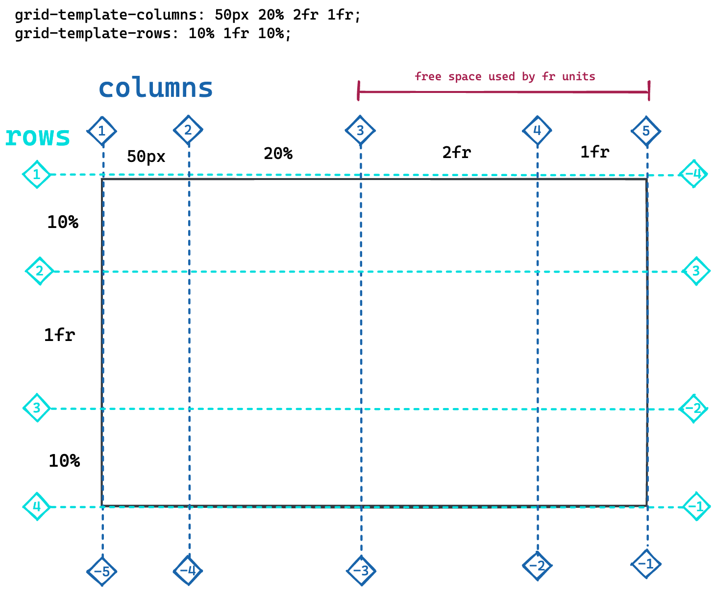
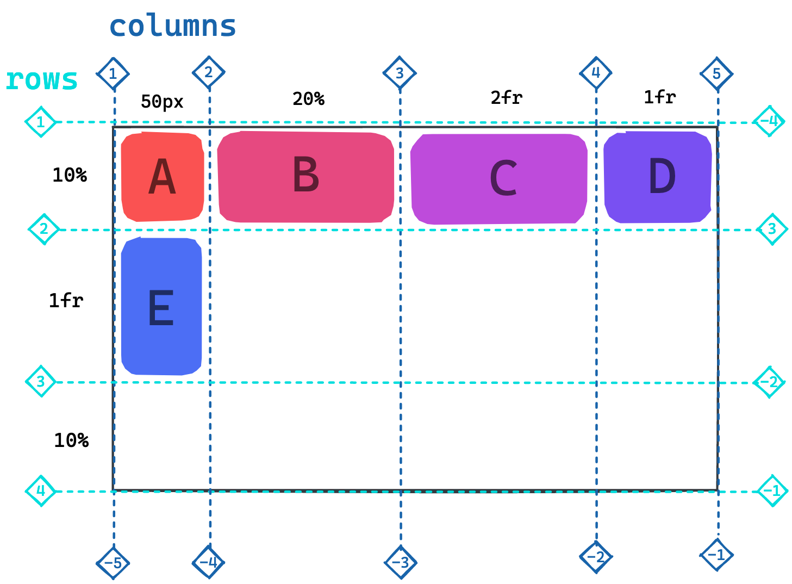

# CSS Grid Layout

[CSS Grid](https://developer.mozilla.org/en-US/docs/Web/CSS/CSS_Grid_Layout) is a powerful layout tool that allows you to position HTML elements in a grid
structure, reposition individual elements, stretch items across multiple cells and much more.
In contrast to flexbox, it's a two-dimensional layout system.

Working with CSS Grid Layout contains two major parts:

1. Defining the layout on a container element
2. Positioning the children on the grid cells

## Grid container

Just like CSS flexbox, the display mode is defined on a container element that contains all the
elements to be positioned as direct children in the grid.

```css
.container {
  display: grid;
}
```

The grid is defined by the number and size of it's rows and columns. By default, the grid consists
of one column. The properties for defining the columns and rows are
[grid-template-columns](https://developer.mozilla.org/en-US/docs/Web/CSS/grid-template-columns) and
[grid-template-rows](https://developer.mozilla.org/en-US/docs/Web/CSS/grid-template-rows). With the
[gap](https://developer.mozilla.org/en-US/docs/Web/CSS/gap) property you can define a space between
the grid cells.

### `fr` Unit

The grid layout has the fraction unit `fr` as a special sizing unit.

1. It splits the remaining space in a grid into equally sized fractions. The number of these parts
   is determined by the total amount of fraction units distributed in the row/column template.
2. The individual rows / columns take up the assigned number of fractions.

In the following picture, the last two columns are sized with fraction units. The first of them has
twice the width of the second one.



## Element Positioning

After the grid is set up on the container element, its children are placed inside the grid cells
from left to right, top to bottom. By default, the elements are stretched such that they take up all
the available cell space.



You can change an element's positioning by using the the CSS properties
[grid-column](https://developer.mozilla.org/en-US/docs/Web/CSS/grid-column),
[grid-rows](https://developer.mozilla.org/en-US/docs/Web/CSS/grid-row) or
[grid-area](https://developer.mozilla.org/en-US/docs/Web/CSS/grid-area), which combines the former
into a single CSS shorthand property. Elements can also be stretched over multiple cells.

Each element can be positioned on the columns and rows by using these values:

1. **Column / row index** (see picture above).
2. Negative **index**. Indexing the lines from the other side.
3. The **`span`** value. Defines how many cells the item should stretch across.

Here is an example:


> ❗️ Positioning properties are set on the child elements, not on the container!

## `grid-template-areas`

A completely different approach to position elements inside a grid is to use `grid-template-areas`.

- First the template cells are grouped into named areas. Every created cell is assigned an **area
  name**. Cells with the same name are grouped together to one area. This is done on the container
  element:
  ```css
  grid-template-areas:
    "a a b c"
    "d d d c"
    "e e e e";
  ```
- Then the grid elements are assigned to one of these areas with the `grid-area` property:
  ```css
  .element-a {
  	grid-area: a;
  }
  .element-b {
  	grid-area: b;
  }
  ...
  ```

This will result in the same layout as shown above.

> ❗️ Make sure that the named areas are geometrically possible in the defined grid, otherwise your
> grid won't work.

## Column and Row Alignment

The combined size of the grid columns/rows you defined might be less than a given height/width of
the grid container. In this case you can distribute the columns or rows inside the grid container.

| Property                                                                            | Effect                                          |
| ----------------------------------------------------------------------------------- | ----------------------------------------------- |
| [justify-content](https://developer.mozilla.org/en-US/docs/Web/CSS/justify-content) | Sets the alignment of the `columns`.            |
| [align-content](https://developer.mozilla.org/en-US/docs/Web/CSS/align-content)     | Sets the alignment of the `rows`.               |
| [place-content](https://developer.mozilla.org/en-US/docs/Web/CSS/place-content)     | Sets the alignment of the `rows` and `columns`. |

## Cell Alignment

The position of the elements _inside_ their cells can be specified on the grid container.

| Property                                                                        | Effect                                          |
| ------------------------------------------------------------------------------- | ----------------------------------------------- |
| [justify-items](https://developer.mozilla.org/en-US/docs/Web/CSS/justify-items) | Sets the `horizontal` alignment.                |
| [align-items](https://developer.mozilla.org/en-US/docs/Web/CSS/align-items)     | Sets the `vertical` alignment.                  |
| [place-items](https://developer.mozilla.org/en-US/docs/Web/CSS/place-items)     | Sets the `vertical` and `horizontal` alignment. |

---

## Resources

- [Complete Guide to CSS Grid](https://css-tricks.com/snippets/css/complete-guide-grid/)
