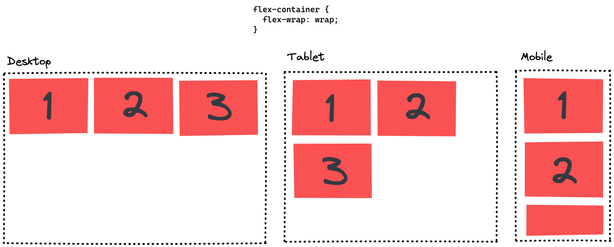

# CSS Flexbox

## Learning Objectives

- understanding the purpose of flexbox:
  - letting items fill out the possible space in their container
  - distributing elements for different screen sizes
  - making the website more responsive with flexbox
- understanding the most important flexbox properties
- knowing the difference between **main-axis** and **cross-axis**

---

## Flexbox

Flexbox is a powerful CSS tool to layout your HTML elements, especially when you want to align
elements horizontally. It is defined on a container element, containing multiple elements whose
position will be determined by the flexbox rules. You define it as follows:

```css
.container-element {
  display: flex;
}
```

Flexbox does the following:

- All child elements will be displayed next to each other along the main axis, the horizontal axis
  by default. The perpendicular axis is called cross axis.
- If the width of all child elements exceeds the container's width, the child elements will be
  shrunk such that they all fit into the available space.

This behavior can be modified to achieve some very useful layouts. The most important flex
properties are listed in the following table.

---

## Important Flex Properties

| property                                                                            | effect                                                                                                                                       |
| ----------------------------------------------------------------------------------- | -------------------------------------------------------------------------------------------------------------------------------------------- |
| [justify-content](https://developer.mozilla.org/en-US/docs/Web/CSS/justify-content) | Defines the positioning of elements along the main axis. Useful values: `flex-start`, `flex-end`, `center` , `space-between`, `space-evenly` |
| [align-items](https://developer.mozilla.org/en-US/docs/Web/CSS/align-items)         | Defines the positioning of elements along the cross axis. Useful values: `flex-start`, `flex-end`, `center`                                  |
| [gap](https://developer.mozilla.org/en-US/docs/Web/CSS/gap)                         | Defines the minimum spacing between elements.                                                                                                |
| [flex-direction](https://developer.mozilla.org/en-US/docs/Web/CSS/flex-direction)   | Sets the direction of the main axis. Useful values: `row`, `column`                                                                          |
| [flex-wrap](https://developer.mozilla.org/en-US/docs/Web/CSS/flex-wrap)             | Modifies how elements can wrap into another row instead of being squashed into one row. Useful values: `wrap`, `no-wrap`                     |

> 💡 [This very detailed cheatsheet](https://css-tricks.com/snippets/css/a-guide-to-flexbox/)
> includes everything you will ever need when working with flexbox.

---

## Flex-direction

This very fundamental property lets you define which axis should act as main axis. In this picture
you can see its effect.


As you can see it changes the layout completely. Also notice, that the property `align-items`, which
defines the positioning on the cross axis, also changes with the definition of the flex-direction.

---

## Flex-wrap

This property is very useful for creating responsive layouts. With the property set to
`flex-wrap: wrap` the elements flow into the next row when they wouldn't fit into the current row.
Depending on the screen width, the content can align itself, as shown in the following example.



---

## Resources

- [Flexbox Cheat Sheet](https://css-tricks.com/snippets/css/a-guide-to-flexbox/)
- [MDN web docs: Flexbox](https://developer.mozilla.org/en-US/docs/Learn/CSS/CSS_layout/Flexbox)
- [CSS Battle](https://cssbattle.dev/)
