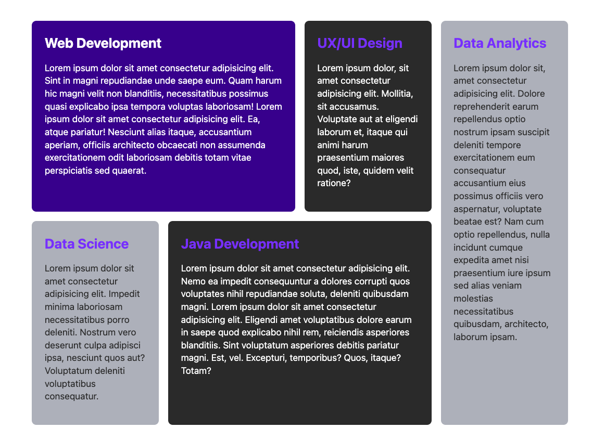

# CSS Grid

> 💡 feel free to create a personal branch of this guide to add your own notes

| duration | content         |
| -------- | --------------- |
| 0:45     | Session         |
| 1:30     | Active Learning |
| 0:15     | Recap           |

## Learning objectives

- using CSS Grid to layout Webpages
- positioning elements in Grid cells
- aligning cells in a Grid

---

## Arrival: Motivate students and prepare them for today's topic(s)

> 💡 Breathe and relax :)

### Which important problem will we solve today?

Some layouts are hard (if not impossible) to create with the layout methods we already know. Grid is
another way to create more complex two-dimensional layouts.

### Why is the content of today's block that important for the students?

You need to know the most important layout methods, to decide what method to use when and why.

### Pose a question to be answered by the end of the block!

Why do we need another layout algorithm for the web?

---

## Activate prior knowledge of students

### Which previously learned concepts will be utilized in this session?

- Some flexbox

---

## Demo

Run this demo locally in your terminal:

```
npx ghcd@latest spicedacademy/fs-web-exercises/tree/main/sessions/css-grid/demo-start
```

You can check out the final version of this demo with:

```
npx ghcd@latest spicedacademy/fs-web-exercises/tree/main/sessions/css-grid/demo-end
```

## Inform: Session Guide

- Grid is a very versatile layout mechanism with many properties.
- This session only shows one possible way of approaching the subject.

### Introduction to Grid

- Grid can be compared to Flexbox, in that it is another way to `layout items within a container`.
- Grid `items are placed in a grid of rows and columns`.
- We can `define a template` of rows and or columns on the container.
- We can then `place the items` inside these rows or columns.
- Grid has very powerful algorithms for automatically creating rows and columns (`grid-auto-rows`,
  `grid-auto-columns`), as well as automatically placing items.
  - That means that you can sometimes get away with defining just a few things and the rest will
    just fall in place. → _Ask students to keep this in mind when doing the demo._
- Grid supports `gap` just like Flexbox.

### Flexbox vs. Grid

- Explain that:
  - 🧘 **Flexbox** works on `one dimension` (either rows _or_ columns).
  - 🗓 **Grid** works on `two dimensions` (rows _and_ columns).
    - (You can do two dimensional layouts with nested or wrapping flexbox-layouts, but it's still a
      bit limiting)
  - 🧘‍♀️ **Flexbox** works great for more linear designs, when layout is mostly determined by content
    order. (`content first`)
    - (Yes, there is `order` and `reverse`, but still…)
  - 🗓 **Grid** can be used for non-linear layouts that can be quite independent from content order.
    (`layout first`)
  - 🧘‍♀️ **Flexbox** is great for lists or `smaller layouts`.
  - 🗓 **Grid** is designed for `larger-scale layouts`.

### A Simple Grid Demo

- Use the [Demo End](#demo) to show students the result we're working towards (or just show the following image):



- Open the demo and show the students around the project.
- Switch to `styles.css` of the demo and start at the bottom of the style sheet.
- Set `display: grid` on the `.bootcamp-grid` container and explain that nothing much changes
  visually.
- Just like with Flexbox the container is now the `grid container` and all of it's direct children
  are `grid items`.
- Open the dev tools and enable grid overlay for the container.
- Add `gap: 1rem` to the container and explain how gap is far easier to work with than margins.
- Show the layout that we're trying to achieve and explain how to read columns and rows from it.
- Add `grid-template-columns` to the container (**We're now defining the template, and let grid
  automatically place items!**):
  - set it to `200px` → You get **1** column that is 200px wide
  - set it to `200px 200px 200px` → You get **3** columns each 200px wide
  - set it to `20% 20% 20%` → You get **3** columns each 20% (of the container) wide
  - Explain that there is very cool grid specific unit: `1fr` means "evenly divide between all
    `1fr`s"
  - set it to `1fr 1fr 1fr` → You get **3** columns evenly divided
  - Explain that `fr` unit can do other values than 1, but thats in the handout.
  - set it to `1fr 1fr 1fr 1fr` → That is annoying to type out!
  - set it to `repeat(4, 1fr)` → You get **4** evenly sized columns - way nicer 😮‍💨
- Explain that we do not need to define `grid-template-rows` here (and in fact most of the time).
  Grid automatically creates new rows when they are needed. For now it's one less thing to think
  about.
  - Auto-rows have no explicit height, they match the height of the tallest item per row.
- We want `.bootcamp--1` and `.bootcamp--4` (Web und Java Development) to span two columns. (**We
  therefore need to tell grid explicitly how and where to place items!**) Select them and add
  `grid-column: span 2`.
- Now we want to position `.bootcamp--5` (Data Analytics) in the last column spanning two rows:
  - Explain that `grid-column` is shorthand for `grid-column-start` and `grid-column-end`.
  - Introduce students to `grid line numbers` in the dev tools overlay.
  - Add `grid-column-start: 4`, show that it is the same as `grid-column: 4`.
  - Now to make it start in the correct row, add `grid-row-start: 1`. Point out that it
    automatically pushes other elements out of the way into other grid cells. (That is the auto
    placing algorithm at work.)
  - Add `grid-row-end: span 2`. ✨
  - You can shorten it to: `grid-row: 1 / span 2`

---

### Working with `grid-template-area`

- Start with a fresh copy of the
  [demo](#demo).
  Explain that there is a way to "draw" the grid template in CSS using "ASCII art". Add the
  following code into the CSS:

```css
.bootcamp-grid {
  display: grid;
  gap: 1rem;
  grid-template-areas:
    "web web  ux   da"
    "ds  java java da";
}
```

- Explain why we're not seeing the layout yet: The template is defined, but the children don't yet
  know in which area (slot) they should be placed.
- Show the named areas in the dev tools.
- Add the `grid-area` property to place children inside the areas:

```css
.bootcamp--1 {
  grid-area: web;
}
.bootcamp--2 {
  grid-area: ux;
}
.bootcamp--3 {
  grid-area: ds;
}
.bootcamp--4 {
  grid-area: java;
}
.bootcamp--5 {
  grid-area: da;
}
```

- Explain how `grid-template-areas` can be very visual.
- Point out that the columns are not equal width anymore and that we want 4 columns that all have
  the same width.
- Add `grid-auto-columns: 1fr` to the container.
  - Remind students, that grid automatically creates columns and rows.
  - Using the `grid-auto-columns` property we can specify the size of automatically created columns
    (or rows with `grid-auto-rows`)
- Explain that these were just some ways to use grid, but that there are more ways.

---

> 💡 This guide attempts to give a simple introduction into CSS grid. It is only one possible way of
> approaching the subject and intentionally ignores many grid properties (such as alignment,
> auto-fit/fill, minmax, named lines, etc.). Most of what is not covered here is part of the
> handout.

---

## Process: Challenges

- Provide the [handout](css-grid.md) and [challenges](challenges-css-grid.md) to the students
- Open the handout and walk the students through the tasks
- Divide the students into groups of 2
- Remind them of the ground rules:
  - meet again 30 min before lunch break in the class room
  - they can ask the coaches for help at any time
  - always try to help each other
  - take a break within the next 1.5 hrs
  - keep an eye on Slack

---

## Evaluate: Recap of the assignment / Discussion of the MVP / Solution

- Revisit the question that was posed in the beginning of the session and try to answer it with a
  few phrases.

---

## Checkout

> 💡 In case the students seem frustrated try to find some encouraging words (e.g. remind them of
> how far they have come already) :)

- Summarize the day by repeating all of the topics that were discussed
- Highlight the progress made that day
- Encourage the students to repeat what they learned with practical exercises
- Remind them to rest :)

## Keywords for Recap:

grid, grid-template, 1fr, span 2

> These keywords are for the weekly summary on Fridays. We use the keywords to automatically
> generate excalidraw tags with the help of
> [this amazing tool](https://github.com/F-Kirchhoff/tag-cloud-generator). The students structure
> the cards in a pattern that makes sense for them. Each tag, that is added to the structure needs
> to be explained in a few words by one student. We go in rounds one by one until all tags are
> included in the structure.
