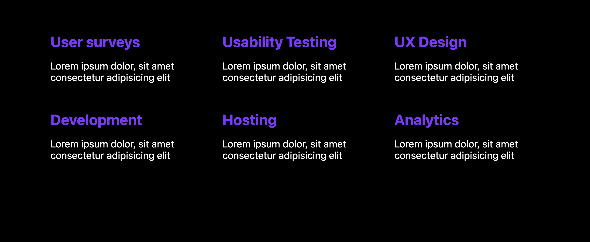

# Challenges: CSS Grid

## Grid Games

Master this Grid Game:

- [Grid Garden](https://cssgridgarden.com/)

This one is an optional home work:

- [Grid Attack](https://codingfantasy.com/games/css-grid-attack/play)

> 💡 Both games provide you with useful information for the following challenges.

## Grid Challenges

Solve the following Grid Challenges

> 💡 Not all challenges have to be solved during session time. Use the remaining challenges as
> practice for your independent learning time after class.

### Image Gallery

(difficulty: 🌶️)

Solve the _Image Gallery_ challenge by running this command in your Terminal:

```bash
npx ghcd@latest spicedacademy/fs-web-exercises/tree/main/sessions/css-grid/image-gallery
```

Expected Result:


### Service Gallery

(difficulty: 🌶️)

Solve the _Service Gallery_ challenge by running this command in your Terminal:

```bash
npx ghcd@latest spicedacademy/fs-web-exercises/tree/main/sessions/css-grid/service-gallery
```

Expected Result:



### Payment Cards

(difficulty: 🌶️)

Solve the _Payment Cards Challenge_ challenge by running this command in your Terminal:

```bash
npx ghcd@latest spicedacademy/fs-web-exercises/tree/main/sessions/css-grid/payment-cards
```

Expected Result:


### Image Board

(difficulty: 🌶️🌶️)

Solve the _Image Board_ challenge by running this command in your Terminal:

```bash
npx ghcd@latest spicedacademy/fs-web-exercises/tree/main/sessions/css-grid/image-board
```

Expected Result:


### Place The Elements

(difficulty: 🌶️🌶️🌶️)

Solve the _Place The Elements Challenge_ challenge by running this command in your Terminal:

```bash
npx ghcd@latest spicedacademy/fs-web-exercises/tree/main/sessions/css-grid/place-elements
```

Expected Result:


