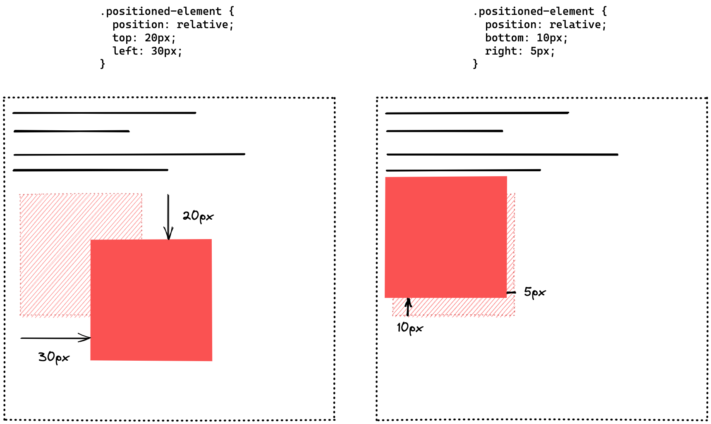
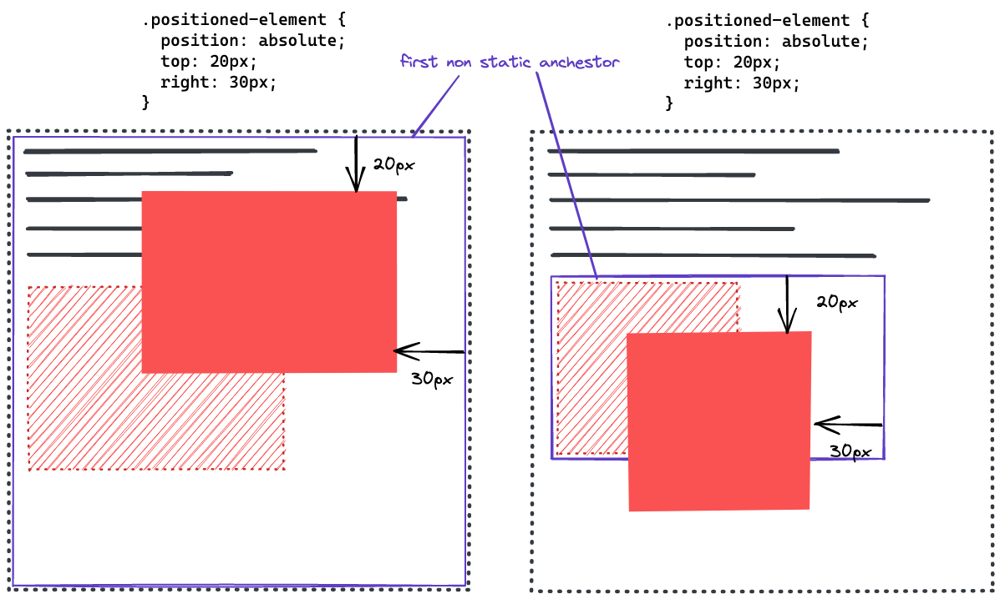
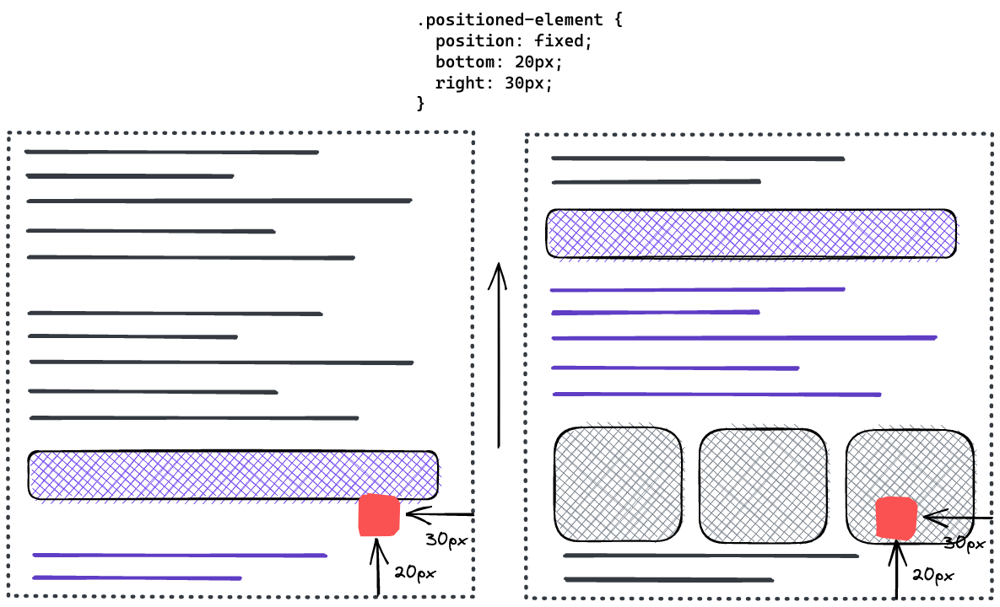
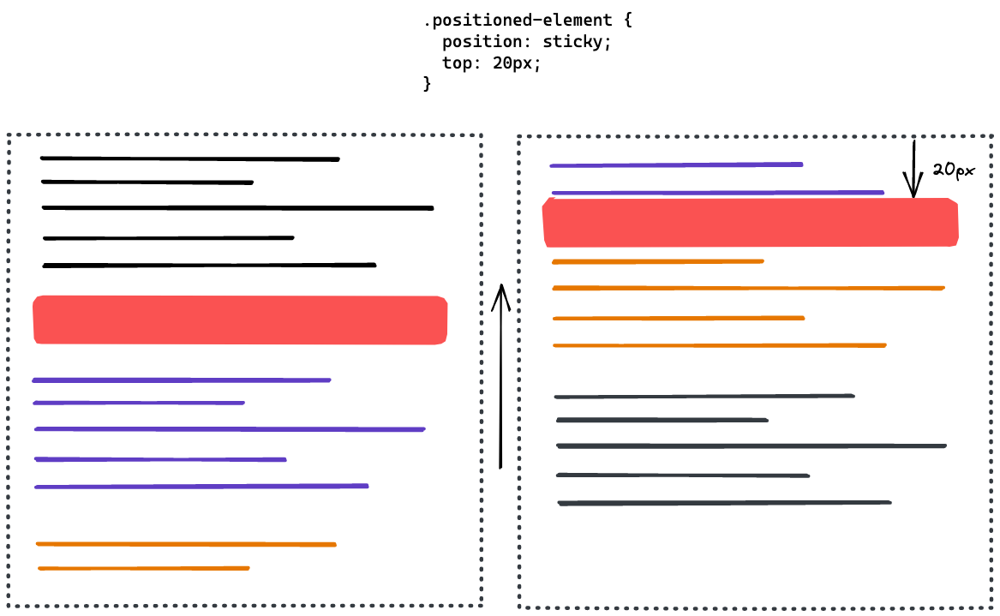

# CSS Positioning

## Learning Objectives

- using the different types of positioning
- knowing the CSS properties to define a position
- understanding the basics of z-index

---

## Positioning

The position property comes in handy if you want to place an HTML element manually. There are 5
different values to define the position:

| Type                 | Description                                                                                                         |
| -------------------- | ------------------------------------------------------------------------------------------------------------------- |
| `position: static`   | The position of the element is determined by the document flow (default)                                            |
| `position: relative` | Position the element relative to where the element would be placed normally                                         |
| `position: absolute` | Position the element absolutely inside the **nearest non-static ancestor element**                                  |
| `position: fixed`    | Position the element on a fixed position on the screen.                                                             |
| `position: sticky`   | The element is placed normally in the document flow, but keeps an offset relative to its nearest scrolling ancestor |

The position is then specified by the four position properties `top`, `bottom`, `right`, `left`.
These work differently depending on the positioning method.

---

## `position: static`

Elements are positioned according to the normal document flow. The properties `top`, `bottom`,
`right`, `left` have no effect. This is the default value.

---

## `position: relative`

Elements are positioned according to the normal document flow and then displaced by the `top`,
`bottom`, `right`, `left` properties. This method is also used to set the reference frame for an
absolutely positioned child element. By doing so, the child element will be placed absolutely inside
this element.

## `position: absolute`

Elements are removed from the normal document flow and no space is created for them - so they leave
no gap in the page. With position absolute you place an element (with the `top`, `bottom`, `right`,
`left` properties) relative to a reference frame. The reference frame is the view-box of the closest
ancestor element that does not have `position: static` (default).

In the picture below you can see two examples.

In the first, no non-static ancestor element exists, therefore the reference frame falls back to the
page.

In the second example, the element is inside another element with `position: relative`. Therefore,
the element is placed absolutely towards this element and not the entire page.

---

## `position: fixed`

Elements are removed from the normal document flow and no space is created for them - so they leave
no gap in the page. An element with position fixed is not influenced by scrolling and therefore
stays at the specified position. This is often used for navigation bars or "back to top" buttons.

---

## `position: sticky`

This is an unusual but very nifty positioning method. The element is not affected by the positioning
until it comes near the border of its scrolling container (normally the page itself). When the user
continues scrolling, a specified offset is enforced. The element sticks to this offset and appears
like a fixed element.

---

## `z-index`

The z-index defines the stacking order of html elements. Elements with a higher stacking order
appear on top if they overlap with other elements. The z-index can be an integer number (negative
numbers are possible) or it can have the default value `auto` which sets the stack order equal to
its parents. The z-index only effects positioned elements - that is elements with a non-static
position value.

---

## Resources

- [MDN web docs: position](https://developer.mozilla.org/en-US/docs/Web/CSS/position)
- [MDN web docs: Using positioning](https://developer.mozilla.org/en-US/docs/Learn/CSS/CSS_layout/Positioning)
- [MDN web docs: z-index](https://developer.mozilla.org/en-US/docs/Web/CSS/z-index)
- [MDN web docs: Using z-index](https://developer.mozilla.org/en-US/docs/Web/CSS/CSS_Positioning/Understanding_z_index/Adding_z-index)
- [MDN web docs: Stacking context](https://developer.mozilla.org/en-US/docs/Web/CSS/CSS_Positioning/Understanding_z_index/The_stacking_context)
- [`z-index` and stacking context by Josh W. Comeau](https://www.joshwcomeau.com/css/stacking-contexts/)
