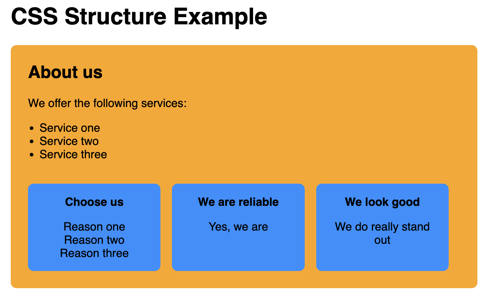

# CSS Structure

## Learning Objectives

- Understanding how the browser decides which CSS property to use when there are conflicting rules,
  regarding CSS cascade and CSS specificity
- Structuring CSS to improve maintainability and readability
- Organizing and naming CSS classes with BEM method
- Creating and reusing Custom CSS properties, also called CSS variables

---

## CSS Cascade

The cascade is the algorithm that defines which CSS rules are being applied when there are
conflicting rules.

When styling an element the browser:

1. Searches for all rules with matching selectors
2. Sorts the rules by their importance taking into account:
   - Whether the declaration is followed by **!important**
   - The rule's origin (Browser stylesheet, User stylesheet, Author stylesheet)
3. Sorts rules by their [specificity](#specificity), if there are multiple rules with the same
   importance according to no. 2.
4. Chooses the last declaration over previous ones, if there are multiple rules with the same
   importance and the same specificity.

You can read about the details in the
[CSS Cascade mdn docs](https://developer.mozilla.org/en-US/docs/Web/CSS/Cascade).

> ❗️ We recommend never using !important unless you absolutely have to. It is almost impossible to
> overwrite a CSS rule with !important.

---

## Specificity

The specificity of a CSS selector tells the browser which rule is most relevant for an element. The
more specific rules win over less specific ones.

You can find a list of the specificity of different selectors on
[specifishity.com](https://specifishity.com/).

The **universal selector** is the lease specific one. It is overwritten by any other CSS rule with
any other matching CSS selector.

**type selectors** like `div` have a low specificity and can easily be overwritten.

**class selectors** like `.bright` and **attribute selectors** like `[type=checkbox]` have a higher
specificity.

---

## CSS Structure best practices

- keep your CSS consistent throughout a project. In collaborative projects, there are often coding
  style guidelines.
- separate global and local styles into different files (or sections of files)
- create multiple stylesheets for different parts of your application
  - structure your code by thinking in reusable **components**. You can write your CSS for every
    component in its own CSS file.

### How to import one stylesheet or multiple stylesheets into another stylesheet

You can import one stylesheet into another stylesheet using **@import**:

```css
@import "customer-card.css";
```

---

## CSS practical strategies

There is no single strategy to approach HTML and CSS cooperation, since it mostly depends on the website / application size and target.

Here we present some concrete scenarios.

### Highlight a product in offer

```html
<article class="product">
  <h2>Amazing Article</h2>
  <span>Price: 66</span>
</article>
<article class="product product-in-offer">
  <h2>Intrepid Item</h2>
  <span>Price: 99</span>
</article>
<article class="product">
  <h2>Pretty Product</h2>
  <span>Price: 54</span>
</article>
```

```css
.product {
  background-color: yellow;
  padding: 1rem;
  border-radius: 0.5rem;
}

.product-in-offer {
  background-color: orange;
}
```

### Preventing unwanted cascading

Let's say we have an homepage with multiple `.homepage-section`, one of them looking like this:

```js
<section class="homepage-section">
  <h2>About us<h2>
  <p>We offer the following services:</p>
  <ul>
    <li>Service one</li>
    <li>Service two</li>
    <li>Service three</li>
  </ul>
  <div class="cards">
    <article>
      <h3>Why you should choose us</h3>
      <ul>
        <li>Reason one</li>
        <li>Reason two</li>
        <li>Reason three</li>
      </ul>
    </article>
    <article>...</article>
    <article>...</article>
  <div>
</section>
```

The section has some cards at the bottom, yielding the following output:



Now both the section itself and the first article have a `<ul>`, and styling them in an incautious way would propagate the definitions to the article, see:

```css
.homepage-section ul {
  padding: 0 1rem;
  margin-bottom: 2rem;
}

.homepage-section .cards article ul {
  margin: 0;
  padding: 0;
  list-style: none;
}
```

Even to the padding is overridden by the second definition, the margin from the first one would still applied.

Possible solution? Use the `>` selector:

```css
.homepage-section > ul {
  padding: 0 1rem;
  margin-bottom: 2rem;
}
```

Now the definition applies just to the `<ul>`s that are **direct descendants** of the section.

[You can see a working example here][CSS Structure Example #1].

### BEM

Among the various naming conventions, a popular one is [BEM][Introduction to BEM]. It suggests the concept of blocks, elements and modifiers like:

```html
<article class="product">
  <h2 class="product__title">Amazing Article</h2>
  <span class="product__price">Price: 66</span>
</article>
<article class="product product--in-offer">
  <h2 class="product__title">Intrepid Item</h2>
  <span class="product__price">Price: 99</span>
</article>
<article class="product">
  <h2 class="product__title">Pretty Product</h2>
  <span class="product__price">Price: 54</span>
</article>
```

- the `<article>` is a **block**;
- the `<h2>` and `<span>` are **elements** contained in the block, and are named like `{block}__{elementName}`;
- the second `<article>` is displayed in a different way thanks to the `product--in-offer` modifier class, that is named like `{block}--{modifierName}`.

You are not required to use BEM, but you may encounter it in some challenges or examples.

### Kebab Case naming convention

The kebab case naming convention defines to use hyphens to separate words in variables. Many
developers use the kebab case convention to write css classes. In BEM we also use kebab case, for
example:

```css
.customer-card {
  ...;
}

.customer-card__button {
  ...;
}

.customer-card--disabled {
  ...;
}
```

---

## Custom properties (CSS variables)

You can store values in custom properties, so you can use them again multiple times without having
to write the value.

A common practice is to define variables in the `:root` pseudo class selector as follows:

```css
:root {
  --primary-color: #ff00ff;
  --secondary-color: #f00f0f;
}
```

> ❗️ Custom properties have to be prefixed with `--`

You can use the custom properties as follows:

```css
.customer-card {
  color: var(--primary-color);
  background-color: var(--secondary-color);
}
```

You can check an [example implementation of CSS Variables here](https://codesandbox.io/s/css-structure-custom-variables-lmxcc9?file=/css/styles.css)

---

## Resources

- [MDN docs: CSS Cascade](https://developer.mozilla.org/en-US/docs/Web/CSS/Cascade)
- [specifishity.com](https://specifishity.com/)

[Introduction to BEM]: http://getbem.com/introduction/
[CSS Structure Example #1]: https://codesandbox.io/s/css-structure-exampe-sv8xd9?file=/index.html
