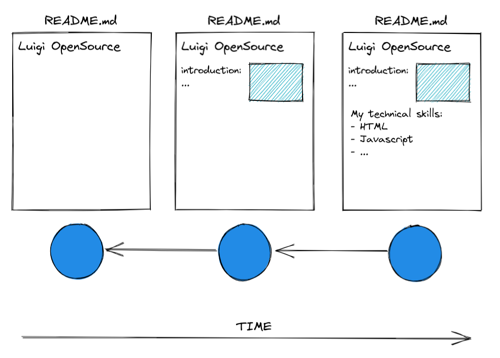

# GitHub and Markdown

> 💡 feel free to create a personal branch of this guide to add your own notes

| duration | content         |
| -------- | --------------- |
| 1:00     | Session         |
| 1:30     | Active Learning |
| 0:30     | Recap           |

## Learning objectives

- Understanding version control and why is it so useful / important?
- Importance of GitHub in dev community
- Creating repositories on GitHub
- Creating / editing files on GitHub
- Creating commits on GitHub
- Understanding Markdown
- How to write Markdown

---

## Arrival: Motivate students and prepare them for today's topic(s)

> 💡 Breathe and relax :)

### Which important problem will we solve today?

- How to manage source code in a team. Importance of Version Control Systems (VCS):
  - How would you share code among team members without a VCS?
  - How would you "go back" to previous code versions (and serve previous software versions) when
    there is a bug in production?

### Why is the content of today's block that important for the students?

- You are starting your professional developer career today. After today you will have your own
  presence & presentation on one of the the worlds biggest platforms for code sharing.
- Many companies use GitHub to get an overview about skills of a candidate

---

## Activate prior knowledge of students

- You can ask these questions:

  - Have you come into contact with a VCS before (and how / why)?
  - Can you think of anything where a VCS would have been helpful to you (e.g. writing an assay and
    accidently deleting parts of it)?
  - Show example of badly versioned text files:

  

---

## Inform: Session Guide

### Git Workflow

**1. Draw a picture explaining Git Workflow (Commits only) like this one:**

> [Excalidraw link](https://excalidraw.com/#json=yDnqD1zakF2RAhdNcw7H_,UcR_F-8FYr8SwID2ugeHsg)

**2. Explain / draw use cases:**

- Go back to a previous commit and continue work from there
- Fork someone elses repository and continue work from any commit

**3. Explain core principles / terminology:**

- `version control system` : a system for managing the files of a project and its different
  versions (i.e. source code, text files, pictures). Two most relevant use cases:
  - It enables developers to "go back" to earlier versions of the source code.
  - It facilitates collaboration (sharing / synchronizing different versions of files).
- `repository` : a centralized storage for a project with a record of all different versions
  (historisation).
- `git` : a version control system that enables developers to create commits and a history of
  their projects
- `commit` : a savepoint in a project that can be returned to at any time. It's a snapshot of
  the current changes. The sum of all commits define the history of a project or file.
- `hash` : a unique identifier of a commit.
- `GitHub` : a cloud based repository hosting service (a place where git projects can be stored
  online and be shared outside of your local machine / computer). It also has additional
  Services (CI/CD, DevOps Workflows) and is a platform for exchange on different projects.
- `difference of git and GitHub` : git is the software that runs on your own computer. GitHub is
  a repository hosting service that enables whole teams to work on one and the same
  `remote repository`.

**4. Show briefly how to create a repository on GitHub.**

- Create a repository `my-first-repository`. (Uncheck the checkbox "Add a README file"!)
- Create a README.md file manually and create the first commit.
- Add content (example text, or any other idea you might have) and create a commit.

Example text: My first day on GitHub Today I learned that version control is an essential part of my
career as web developer. Some keywords that I should remember for later are: git, GitHub, version
control, repository, commit and hash. The next 3 months will be a very exciting time, as I will
learn new things every day.

### Markdown

**1. Show the preview of your file and demonstrate the lack of formatting** (fehlende
Übersichtlichkeit)

**2. Explain what Markdown is:**

- Markdown is a minimalistic markup language for formatting text, with the `.md` file ending:
  "example.md"
- It has a specific syntax, but also HTML syntax can be used in Markdown files.

**3. Add Markdown syntax to your README.md file:**

- Add "#" in front of the headline "My first day on GitHub"
- Highlight the words "essential part" as **bold** text
- Add an unordered list for the keywords
- Add a
  > blockquote for the last phrase
- Add an example image this: 
- Feel free to show any other markdown syntax. You can find an overview
  [here](https://www.markdownguide.org/cheat-sheet/) or
  [here](https://github.com/adam-p/markdown-here/wiki/Markdown-Cheatsheet#emphasis)

---

## Process: Project / Assignment

- Explain the process in general (Breakoutrooms / They can ask the coaches for help at any time
  / Where to find the project tasks / Tell them to help each other / Take a break when you need
  it in the next 1.5h / Keep and eye on Slack...)
- Provide the [handout](github-and-markdown.md) to the students
- Open the handout and walk the students through the structure (summary on top and tasks on the
  bottom of the handout)
- Divide the students into groups of 3-4
- Tell students to meet again 30min before lunch break in the classroom

---

## Evaluate: Recap of the Assignment

- Ask the students if someone would like to share their README.md file
- Let them explain their working process
- Analyze their commit history
- Try to get as interactive with the students as possible (e.g ask for their opinions on the
  commit messages that were written)
- Optional: Open a thread in Slack to let them post links to their README.md

---

## Checkout

- Summarize the day by repeating all of the topics that were discussed
- Highlight the progress made that day
- Encourage the students to repeat what they learned with practical exercises
- Remind them to rest, as its just the first day :)

---

## Keywords for Recap

Markdown, GitHub, git, version control, repository, commit, commit message,

> These keywords are for the weekly summary on Fridays. We use the keywords to automatically
> generate excalidraw tags with the help of
> [this amazing tool](https://github.com/F-Kirchhoff/tag-cloud-generator). The students structure
> the cards in a pattern that makes sense for them. Each tag, that is added to the structure needs
> to be explained in a few words by one student. We go in rounds one by one until all tags are
> included in the structure.
