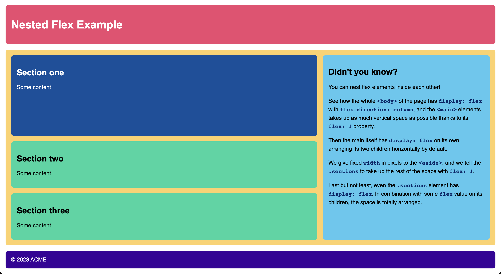

# Challenges - Self Directed Learning Week 2

Out of ideas? Try these things out!

## Flex Component Workout

Want to flex about your flex knowledge? Try to reproduce the following scenarios:


You can find some guidance [here](https://codesandbox.io/s/flex-examples-yjjhr2?file=/index.html).

## Flex Layout Workout

Flex to the max? Achieve full page layouts with flex!



A commented possible solution is available [here](https://codesandbox.io/s/nested-flex-example-msrws7).

## JS Questions

- How many JS data types you know? Why would you pick one over another?
- What's the different behaviour granted by the `let` and `const` keywords?

### Truthiness and Falsiness

What values behave like `true`? Remember:

```js
const isRaining = true;

if (isRaining) {
  console.log("Let's carry an umbrella!");
}
```

The `isRaining` variable holds the `true` value, and definitely passes the `if(isRaining)` condition.

What happens with a general string:

```js
const myName = "Jane";

if (myName) {
  console.log("My name is", myName);
}
```

Now check for yourself what happens with the following:

- the `false` value;
- the `'false'` string;
- an empty string (`''`);
- a positive number;
- a negative number;
- the number 0;
- `null`;
- `undefined`.

Collect the results of your experience and discuss them together.
