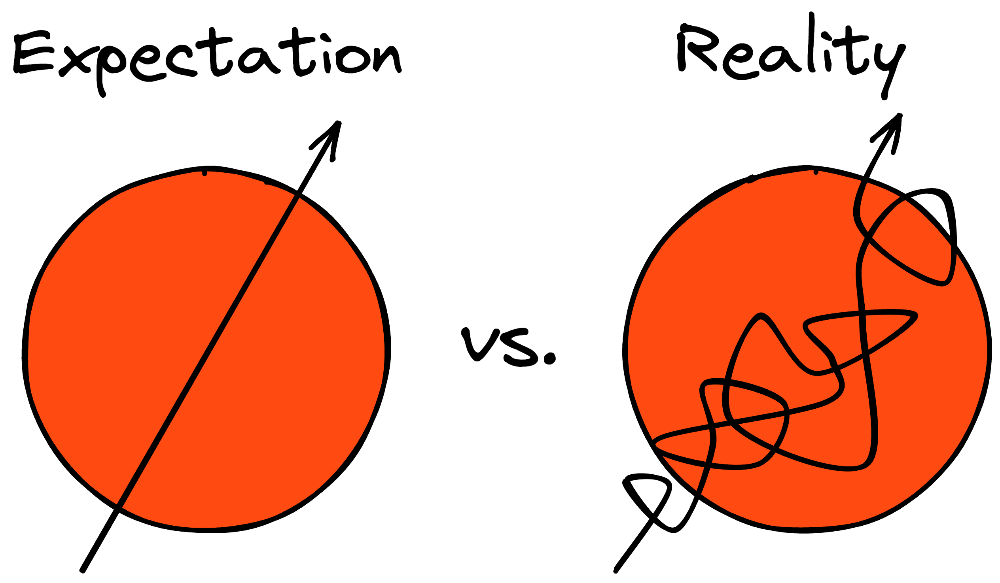
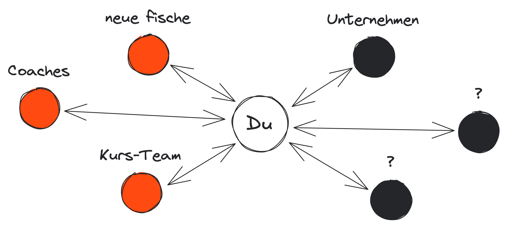

<!-- _class: intro-slide nemo -->

# Expectation Managment in Capstone

---

<!-- _class: image-center -->

---

<!-- _class: image-center -->

---

<!-- _class: big-headline granite -->

# Self-Expectations

---

<!-- _class: bullet-points -->

## Was möchte ich erreichen?

### Du bestimmst deine Ziele und Prioritäten

- Bootcamp Inhalte üben und vertiefen
- neue Themen entdecken, lernen und anwenden
- ...
- **der ultra Fail:** in vier Wochen die unglaublichste App der Welt entwickeln

---

<!-- _class: big-headline granite -->

# Coaches Expectations

---

<!-- _class: bullet-points -->

## Was erwarten wir von dir?

- MVP deiner App Idee
- Capstone Workflow
- Keep on learning
- Clean Code Rules
- Teamwork Rules
- Do Reviews (User Stories, Code Reviews, Quality Assurance)

---

<!-- _class: two-columns-page  -->

### Capstone Tipps

- _Dog Days sind okay_ – nicht generalisieren
- _Kill your Darlings_ – verabschiede dich vom Ideal
- _Milestones_ – kleine User Stories helfen
- _Capstone Workflow_ – hilft, den Focus zu setzen
- _Qualität vor Quantität_ – nötige Features
- **_Teamwork makes the dream work_**

---

<!-- _class: intro-slide nemo -->

# Viel Spaß!
